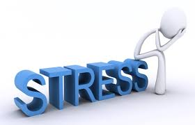

## What is stress?
Stress refers to a physiological and psychological condition in which our body reacts to external pressure or challenging situations. Simply, stress is how our body and mind react when we are in danger or difficulty. Stress can have positive effects on our bodies and minds, but if it continues for a long time, it can have negative effects on our health. 

There are two types of stress: acute and chronic stress. Firstly, acute stress is a temporary and immediate response. For example, before an exam, before an important presentation, or in an emergency situation, your body reacts immediately. At this point, the body releases hormones such as adrenaline and cortisol, and the "fight or flight" response occurs. This helps us to respond quickly in crises. Secondly, chronic stress occurs when stress continues for a long time. If you are stressed for a long time due to excessive work, personal problems, or financial pressure, it can make it difficult for your body and mind to recover, which can have a serious impact on your health. Chronic stress can lead to a number of health conditions, including cardiovascular disease, digestive problems, decreased immunity, and anxiety. Stress can be positive or negative. For example, moderate stress can increase our motivation and improve our ability to solve problems, but excessive stress can harm our physical and mental health. The important thing is to manage stress.

## Physiological effects
When our bodies are stressed, it affects all body systems. Firstly, the musculoskeletal system gets affected. When the body is stressed, the muscles tense up. This is more of a reflex response and is done to protect the body from injury and pain. If you are suddenly stressed, your muscles will tense up all at once, and when the stress is relieved, the tension will be released. However, in the case of chronic stress, the musculoskeletal system keeps the muscles of the body in a state of continuous tension. This continuous muscle tension can cause stress-induced disorders such as muscle paralysis, temporary muscle weakness, muscle Cramps, and autonomic nervous system dysfunction. The cardiovascular system, nextly, is the body system related to the heart and bloodstream. It supplies nutrients and oxygen. Acute stress refers to momentary or short-term stress, such as suddenly hitting the brakes to avoid an accident, which quickly increases the heart rate and causes the heart muscle to contract. Then, it acts as a messenger, such as stress hormones such as adrenaline and cortisol. If this continues for a long time, it can have a major impact on the heart and blood vessels due to rapid heartbeats, thus increasing the risk of high blood pressure, heart attack, stroke, etc. The last is the gastrointestinal system. Stress can affect communication between the brain and intestines in the gastrointestinal system, causing discomfort due to symptoms such as bloating. Also, when you're stressed, the amount you eat can change dramatically compared to usual. You either eat a lot or very little. This can cause esophageal spasms.

## Psychological effects
Psychological stress refers to a state that occurs due to psychological pressure or anxiety experienced in daily life. This is not a problem or situation that occurs externally, but stress occurs depending on the way we think and react. For example, when anxiety or worry builds up in situations such as academic pressure at school or conflicts in relationships with people, we feel stressed. If stress continues, it can upset the balance of mood-regulating chemicals in the brain, such as serotonin and dopamine, causing anxiety and depression, which can make us feel helpless. Symptoms of psychological stress include anxiety. If you worry excessively or are overcome by anxiety, you may lose concentration. Furthermore, functions related to the hippocampus, which is responsible for memory, can deteriorate. Next is depression. You may also feel tired, and when you are stressed, your energy may be depleted, which can cause you to become physically challenged.

In these ways, stress has many effects. While a little stress can increase motivation and improve problem-solving ability, excessive stress can cause physiological symptoms such as indigestion or muscle stiffness and psychological symptoms such as anxiety, decreased concentration, and decreased memory. Therefore, it is important not to continue in the state of excessive stress.

