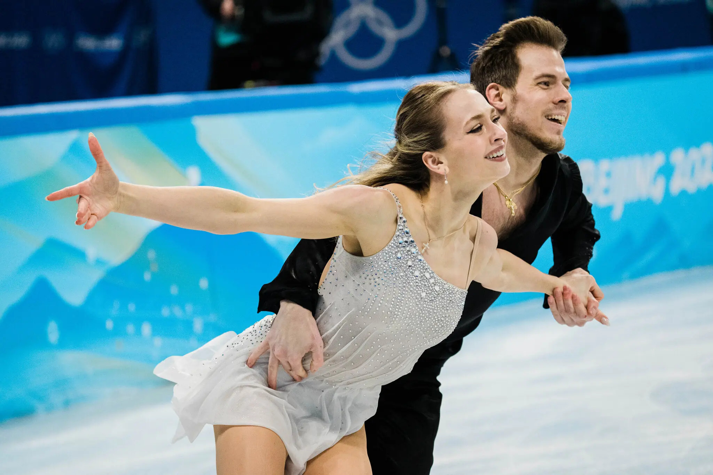

One type of performing arts is dance. The genres of dances that will be explained today are ballet, ice dance, and tap dance. These dance types all have different characteristics and are well-known. I will talk about the basic technical elements of these three dances, their historical background, and some renowned dancers within each genre.

## Ballet

Ballet began in the Italian Renaissance palaces during the 15th century. 19th century ballet is one of the most well-known, and it was the early days of classical ballet. Ballet became most popular in Russia in the late 19th century, and the productions of works such as “The Nutcracker,” “The Sleeping Beauty in the Woods,” and “Swan Lake” were released at that time. Ballet may look easy due to its graceful and slow movements, but it requires tremendous strength and flexibility to execute each technique. There are four types of ballet. The first is the Romantic ballet, which was greatly influenced by the Romantic period of the 19th century. There were mainly male dancers, and expressing emotions was important. Secondly, classical ballet is a traditional form of ballet, and unlike the Romantic ballet, it has a story centered around a female ballerina. It is usually accompanied by an orchestra. Thirdly, modern ballet deviates from classical ballet and does not convey a story, but rather expresses the emotions the choreographer wants to convey. Therefore, it is a little more flexible in terms of structure and costume, so it is sometimes performed barefoot. It is characterized by a wide range of movements. Lastly, neoclassical ballet, unlike classical ballet, is a method that eliminates stage settings and stories.It emphasizes the dancer's choreography that expresses the music. 

## Ice Dance

Ice dancing is one of the most popular sports at the Winter Olympics and involves two people dancing together on ice. It first began at the 1976 Winter Olympics in Innsbruck, Austria. The ice dance competition is divided into two. The first is a short dance that lasts for 3 minutes. A short dance performed by completing a set movement to a specific rhythm. The second is free dance. Unlike the short dance, the free dance is performed by skaters who choose the music and movements they want. Unlike pair skating, where a man and a woman perform together, jumping techniques are not allowed in ice dance. Instead, the focus is on the body movements that express the dance. Ice dancing is not only performed at the Olympics but also at many events. This is called an ice show, and one of the most famous ice shows is “Dancing on Ice.” In this TV show, several figure skaters perform ice dance moves and judges evaluate them. One of the most popular ice dance figure skaters is Tessa Virtue. She performed several times with her partner Scott Moir and went to the Olympics, and she became the youngest person to win a gold medal with her partner. They have been ice dancing together since they were 7 and 9 years old. In this way, ice dancing, in which collaboration with a partner is important, typically begins from a young age.

## Tap Dance

Tap dancing is a genre of dancing that uses shoes with metal tabs on the front and back to make sound by tapping the floor. It originated in the United States during the 19th century. African American slaves often made instruments themselves to make music, but when their instruments were taken away, they made sounds with their bodies to create rhythm. As this became more popular, tap dance was created. The two most basic movements in tap dancing are the shuffle and cramp roll. First of all, the shuffle is the most commonly used movement. The shuffle can be played at various speeds and rhythms, so it can be incorporated into many choreographies. To do the shuffle, first stand with your feet together, place your weight on your left foot, and make sure the heel of your right foot touches the floor. Then sweep the floor with your right foot, place your weight on your right foot, and repeat the same movement with your left foot. This creates the unique sound of tap dance. Second, the cramp roll is a technique that creates and repeats a pattern in the rhythm. This technique is also often used in many choreographies to add a special beat to the dance. To do a cramp roll, start by standing with your feet together, then step your left foot forward slightly and tap it on the floor. Next, take your left foot back and tap your right foot on the floor. This pattern is repeated several times and the sound is produced. Tap dance is not as popular as it used to be, but it continues to be loved for its unique ability to dance and make rhythmic sounds at the same time.