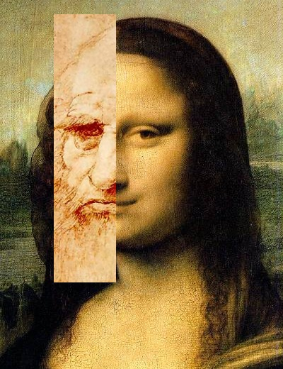

If someone asks people to name Leonardo da Vinci's most famous work, most people will answer the Mona Lisa. Like this, the Mona Lisa is known as one of the masterpiece works made by Leonardo. There are three reasons why this work is famous. First reason is the theft incident, the second reason is the mysterious woman in the work, and last is his drawing technique. I will talk about the Mona Lisa, and the three reasons which made it famous and popular. 

The Mona Lisa is a portrait that was drawn in the 16th century Renaissance period, and it is displayed in the Louvre Museum. Today, it is a work known and loved by so many people that it can be said to be the most famous painting in the world. However, it was originally just one of the many paintings on display at the Louvre Museum. There was an incident that made this painting famous: when it was stolen on August 21, 1911. However, the museum didn't even know that the work had disappeared for a day. When the French government noticed that the work had been stolen a day later, it closed the museum for a week and sealed the French border. In the 20th century, it was a time when newspapers became famous and the use of pictures in newspapers increased, and many famous newspaper companies mentioned the theft of the Mona Lisa in their newspapers. This news spread from France to other countries within a short period of time. As this news became famous, people tried to find suspects, and one of the suspects was the famous painter Pablo Picasso. Picasso was released due to insufficient evidence, but the case began to become even more famous. Two years later, the real culprit was revealed, and he was a museum employee. He expected that this painting would become valuable and stole it to sell. After the culprit was discovered, the Mona Lisa was again displayed at the Louvre Museum. 

Another reason why this painting is so popular is because of the woman in it. After this work became famous, people were curious to know who the beautiful woman in the work was, and there were many speculations. The first guess was that the woman is Leonardo da Vinci himself. It is said that Leonardo painted the picture of himself dressed as a woman. This is because the proportions and features of her face, revealed through AI analysis, are very similar to Leonardo's self-portrait. The most likely guess is that it is just a woman named Lisa. Mona is the Italian word for married woman and Lisa is her name. So, the subject of the painting might be a married woman named Lisa, and Leonardo was commissioned by her husband to paint it. However, there is also an argument that if the painting was commissioned by someone else's wife, Leonardo would have no reason to keep the painting until his passing. As such, the main character in the Mona Lisa has not yet been revealed. 

Lastly, another reason for Mona Lisa’s fame is because of Leonardo’s drawing technique. Leonardo, who was an anatomist, drew the Mona Lisa based on his knowledge of the human body and had accurate human proportions. So the painting looks more realistic than other portraits. Additionally, he didn't use any straight lines when drawing. He believed that the human body had no straight lines and was composed only of curves. However, he instead used a special technique of painting several times to demarcate boundaries. The technique is called sfumato. Fumo is an Italian word meaning smoke, and this technique draws a blurred border. He also used the same technique to draw Mona Lisa's lips. Because of that, people thought Mona Lisa had a mysterious smile, and everyone had their own interpretation of the woman's emotions in the painting. The Mona Lisa is also famous for having no eyebrows. Some say it is because of Leonardo's painting technique which is sfumato, while others say it is because it was popular at the time for women to have bright and thin eyebrows. 

The Mona Lisa is so famous and loved that only it has its own bodyguard among the paintings at the Louvre Museum. Now that you know the reasons why Mona Lisa became famous, you can enjoy the painting more.
