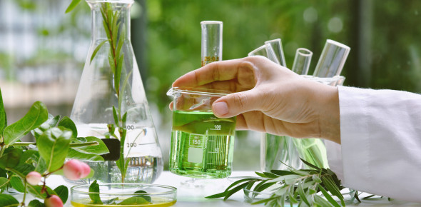

In medicine, many drugs are extracted from plants to treat patients. Morphine is used when strong pain relief is needed, digoxin is used to treat heart disease, etc. Plants with such medical properties are called medicinal plants.

## Morphine
Morphine is a powerful painkiller extracted from the sap of the opium poppy plant. It was first isolated by a German pharmacologist named Friedrich Wilhelm Adam Sertürner in the early 1800s. It acts on the central nervous system to block pain sensations, thereby relieving pain and also calming the mood. Since morphine has such a powerful painkilling effect, it is used for severe pain after trauma or surgery, or for terminally ill cancer patients who are suffering from extreme pain. As powerful as it is, it also has side effects if taken in excess. First, morphine is a highly addictive drug, so too much of it can cause dependence on the drug or resistance to it, which can make it ineffective. An overdose can also suppress breathing.

## Digoxin
Digoxin is a drug extracted from a plant called digitalis and is used to treat heart disease. It was first developed by a British doctor named William Withering, who confirmed the effectiveness of digitalis for heart disease. Since it has a direct effect on the heart, it is very helpful in improving heart function. Digoxin increases the concentration of sodium (Na+) in cells by inhibiting an ion pump called Na+/K+ ATPase. As a result, calcium (Ca2+) accumulates within cells, which strengthens the heart muscle's ability to contract. The representative case of digoxin is its use for people with heart failure or irregular heartbeat. Heart failure is a disease in which the heart cannot pump blood properly, and digoxin increases the contractile force of the heart, which helps improve the pumping function of the heart. It is also effective for irregular heartbeats such as atrial premature contraction (PAC) or ventricular premature contraction (PVC). As a result, shortness of breath and edema are improved. Digoxin also has side effects. First, digoxin can be toxic. In particular, overdose can cause cardiac toxicity and an excessive decrease in heart rate.

## St. John's Wort
St. John's wort, also called hypericum perforatum, is one of the most popular plant-derived antidepressants. Through several studies, it has been found that St. John's wort has similar effects to other antidepressants. Its main effect is to inhibit the reuptake of neurotransmitters such as dopamine, serotonin, and norepinephrine. These are substances that regulate mood, and this drug allows the substances to remain in the synapse for a long time, gradually stabilizing the mood and helping to relieve depression. It is generally known as a natural antidepressant, and is also effective for anti-anxiety and anti-stress. It is usually used mainly for mild or moderate depression, not severe depression. This also comes with side effects. St. John's wort has many interactions with other drugs, so it is necessary to consult a doctor before taking it with other drugs such as birth control pills and anticoagulants. It is well known as an antidepressant, but has the advantage of fewer side effects and being natural compared to existing synthetic antidepressants, SSRIs and SNRIs. However, if depression is severe, it is effective to use professional medication.

## Curcumin
Curcumin, also called Curcuma longa, is a ginger plant from India and Southeast Asia. Turmeric has a yellow root, and the medicine is extracted from the root. It is a powerful anti-inflammatory ingredient, so it has the function of relieving inflammation that causes chronic diseases. Therefore, it is very helpful for antioxidants, anti-cancer, brain, cardiovascular, digestive, etc. Curcumin is a powerful antioxidant, so it removes free radicals in the body and reduces oxidative stress. It can also contribute to preventing cell damage and anti-aging. Furthermore, curcumin has been proven to have anti-cancer properties in several studies. It inhibits cell growth, induces cancer cells, and prevents metastasis. It can also help prevent and improve degenerative brain diseases such as Alzheimer's by increasing the level of nerve growth factor (BDNF) in the brain. Curcumin has no major side effects, but its absorption rate is low.

Medicinal plants have been a factor that has had an important influence on human health and medical development since ancient times. They are used in a variety of ways, not only in traditional medicine but also in modern medicine. Through continuous research, many medicinal plants, including morphine, digoxin, St. John's wort, and curcumin, are currently being used in medicine. 

