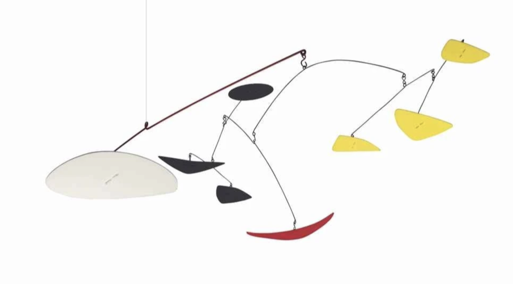

At first glance, art and science may seem to have no connection at all. However, they do indeed have a strong connection. In fact, art and science have been one since ancient times. The Greek word "techne" is an integrated concept of art and science. This was transformed into the word "ars" by the Romans and later began to be called art and technology. This means that arts and science are closely related. There are cases where science is used in art and vice versa. 
One of the most famous examples of using art in science is Leonardo da Vinci. Leonardo was an Italian polymath of the Renaissance period. Many people know him as an artist, but he conducted research in many areas, including painting, science, literature, architecture, etc. He wanted to portray the beauty of the human body as perfectly as possible in his work. So, he dissected human bodies himself, analyzed them scientifically, and presented them in drawings. He painted bones and muscle structures with great precision and detail, creating paintings that were ahead of their time. Thus, his paintings had a huge impact on medicine. This is not only because of his scientific curiosity but also because of his great art skills.

An example of using science in art is kinetic art, which refers to all moving works. One of the most used and well-known examples of kinetic art is mobiles. Mobile is a French word that means “moving,” and it is a moving sculpture made by hanging pieces of various shapes with thin wires or threads to achieve balance. Alexander Calder is a sculptor from Pennsylvania who created the first mobile. His family members were also famous artists, especially his father, who was a sculptor, which led him to become a sculptor as well. He majored in mechanical engineering and studied it throughout his early 20s. This experience helped him create original, creative, and scientific works of art. Usually, when drawing a picture, you think you need a pen and paper, but Calder used wire and pliers for sketching. He used them to draw pictures in the air. He was inspired by Piet Mondrian's paintings and decided to create a moving sculpture. Since he was a mechanical engineer, he used a motor to make the work move. However, he wanted to make it move along the wind, so he removed the motor as shown in the picture below. This had a great influence on the fusion of art and science, breaking the boundaries between art and science that people had at the time.

The last one is pointillism. Pointillism is drawing a picture by only using dots, not lines or surfaces. This technique allows you to paint without a lot of colors. The most famous of these examples is “A Sunday Afternoon on the Island of La Grande Jatte” by French painter Georges Seurat. He invented pointillism himself with the help of his friend Paul Signac. This work depicts people spending their holidays on the island of La Grande Jatte. He was looking for the best way to express light in his work, so what he came up with was using color theory, which was developed at the time. 

Pointillism uses small dots arranged close together so that our eyes mix them together. For example, if yellow and red dots are put together, we see them as orange. Seurat used this method to create green by putting together yellow and blue. Second, there is an afterimage effect in our eyes. So, for example, red and green, which are complementary colors, make each other stand out more. He also used this method in the work. If you look closely at the picture below, the edges of the picture are purple to make the picture stand out more. Using these techniques, he created original paintings that were different from the works of other painters.

In this way, art and science have been intertwined not only recently but also since ancient times. Art and science are closely related, providing creative support to each other. Art inspires science, and science creates uniqueness in art. If you look at the works mentioned today while considering these scientific elements, you can enjoy them more.