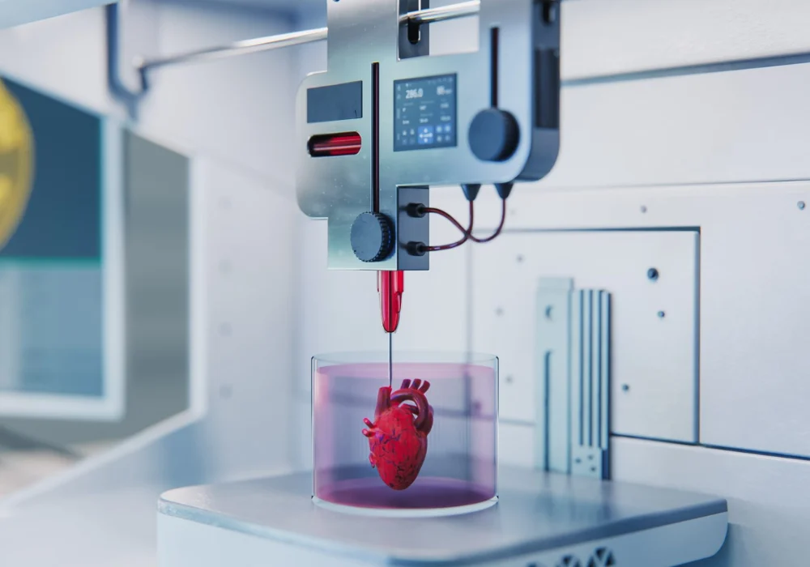

Nowadays, it is possible to 3D print human tissues and organs. This innovative technology is called 3D bioprinting. This technology is used in the medical field to create functional organs and tissues and provide customized solutions. This article will discuss what this technology is, how it works, and what the future prospects are.

## What Is Bioprinting? 
First, bioprinting is a 3D biotechnology that creates tissues and organs by layering cells, bioink, growth factors, etc. The difference from general 3D printing is that the materials are not plastic, but cells and biomaterials. The process of creating tissues and organs can be largely classified into four groups: preprinting, bioink preparation, printing, and post-printing. In the preprinting stage, the tissue structure is first designed on a computer using CT or MRI images. The next stage is the bioink preparation stage. First, bioink is a general term for materials sprayed by a bioprinter. Hydrogels such as collagen are mainly used as materials with soft properties that can be sprayed by a 3D bioprinter. This supplies nutrients to cells and provides an environment necessary for survival. Since it is important that the patient does not have a rejection reaction, the patient's own cells or proteins are cultured, mixed with hydrogels, and then used as materials. The process of preparing gel-shaped materials including cells in this way is the bioink preparation stage. Then, in the printing stage, the bioink is layered to create a structure. Finally, in the post-printing stage, the tissue is allowed to grow well and mature, and then it is completed.

## Application of Bioprinting
Bioprinting is used in various fields. First, it is used for tissue regeneration. For example, bioprinting can reproduce the dermis and epidermis, so it can create new skin for burn patients. It can also create cartilage tissue, so it can print cartilage for damaged joints, noses, ears, etc. It can also regenerate blood vessels. This is an essential element for connecting artificial organs. In addition to these, it can also be used for new drug development and toxicity testing. Animal testing has ethical issues as well as different reactions of humans and animals. However, if you conduct drug testing using 3D-printed liver, heart, kidney tissue, etc., you can test how the drug will affect the human body, and there is no need to worry about ethical issues or different reactions. Lastly, it can be usefully used in dentistry and prosthetics. Bioprinting can print customized dental tissue to print more suitable teeth. By spraying cell-based pulp tissue, you can conduct further research on actual tooth function and apply it to real life.

## Limitations
Bioprinting is very helpful, but it also has clear limitations. First, there is the difficulty in forming blood vessels. Blood vessels are essential for creating large organs, but there are still technical difficulties in creating blood vessels. Another limitation is in the cells. The survival rate of cells is low. Although hydrogels help keep cells alive, there are still many cases where cells die during the printing process. Finally, there are limitations due to ethical issues. Although creating human organs or tissues artificially is very helpful, there are bioethical issues because they are artificial.

## Future Prospects
It can solve the problem of waiting for organ transplants. As it becomes possible to manufacture patient-specific artificial organs, it can solve the problem of organ donation shortage. In addition, since it is manufactured using the patient's own cells, immune rejection reactions are reduced. Also, it has already entered the commercialization stage in areas such as skin transplantation and cartilage restoration, and development to more complex organs is expected in the future. Bioprinting also has industrial growth potential. The global bioprinting market is currently growing rapidly.

## Actual Case
In 2023, during the war with Russia, a Ukrainian soldier was injured and rescued with half of his skull sunken in. The medical team decided that it would be difficult to recover using conventional surgical methods, so they decided to use bioprinting. Based on the patient's CT data, they successfully designed and manufactured a customized skull structure that fit the damaged area. Using this, the patient is receiving treatment well and is maintaining stability.

Bioprinting technology is being used in various fields such as regenerative medicine, pharmaceutical development, drug testing, and personalized treatment. It can reduce organ donation shortage and immune rejection, and can be a way to overcome existing medical limitations. Although bioprinting still has many limitations such as cell survival and function maintenance and ethical issues, it is still in the early stages and has great potential.

