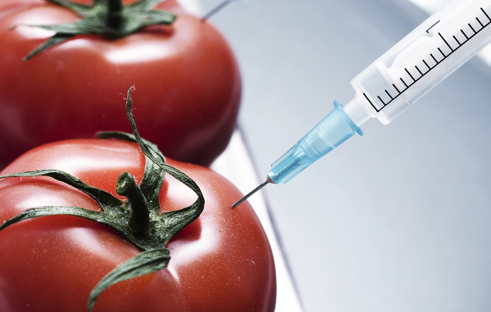

From the potatoes used in fries to the sugars in our drinks, genetically modified organisms (GMOs) are already deeply embedded in our diets. They are praised for their benefits, such as increased productivity, enhanced nutrition, and even reduced pesticide use. However, despite these conveniences and benefits, controversy persists over potential risks, including allergic reactions, uncertain long-term health effects, and broader environmental and ethical problems. Therefore, the question of whether GMO foods are safe for our health is something we should think about carefully, since it affects what we eat every day. 

There are so many advantages of GMOs. First, they can significantly increase the productivity of crops. By modifying certain genes, crops become more resistant to pests, diseases, drought, and other problems, increasing yields. For example, corn has been modified to resist certain moth larvae, which has led to increased yields. This has resulted in increased farm incomes and food security in food-scarce countries. Not only that, but there are environmental benefits as well. By creating pest-resistant crops, pesticide use has been greatly reduced. As a result, it significantly reduced soil and water pollution, promoting sustainable agriculture. Also, it helped a lot in strengthening the influence. For example, fortifying certain crops with omega-3 fatty acids can improve cardiovascular health. In this way, adding essential nutrients to GEM crops can help alleviate nutritional deficiencies. Finally, there are economic benefits. The direct profit improvement was achieved by significantly increasing yields and reducing losses by using GMO crops. Furthermore, reduced pesticide and fertilizer use can help reduce production costs. Not only that, but improved quality and fish safety also enhance domestic and international export competitiveness. In fact, the average income of farmers adopting GMO crops in countries like the US, India, and Brazil is higher than that of non-GMO farmers. However, although numerous advantages of GMO foods exist, their disadvantages can not be ignored.
	
The biggest problem with GMO food that is discussed most is the ethical and social issues. Since the company holds the patent for the SHEM seeds, farmers are obligated to purchase the seeds every year. So, in some developing countries, small farm owners have to bear high costs. This mandatory seed purchase can limit farmers' economic autonomy. Also, some ethicists and consumer groups raise ethical concerns, believing this is an intervention that goes beyond the boundaries of nature. Potential allergy risk is another controversy about GMO foods. GMO foods are often engineered to produce specific proteins by inserting entirely new genes. These artificially created proteins are more likely to trigger allergic reactions in some people. Additionally, these new proteins may be in forms that are not commonly found in conventional foods, which may increase the likelihood of long-term allergies. Major food regulatory agencies such as the FDA and EFSA require GMO foods to be assessed for their allergenic potential and their safety through clinical trials and in vitro analyses. However, because everyone’s immune system is different, potential allergic reactions that may occur in minority groups are not yet fully studied. Another issue is gene flow and its impact on the ecosystem. There is a possibility that genes from GMO crops can spread to surrounding wild plants or weeds. This can turn weeds into superweeds that are resistant to the herbicides used on GMO crops. It makes removal difficult and increases agricultural management costs. Furthermore, repeated cultivation of GMO crops can alter soil microbiota and the habitats of insects and birds, potentially disrupting the ecosystem's balance. Finally, there is the issue of antibiotic resistance. If resistance genes from GMO foods spread to soil microbes or human gut bacteria, antibiotic-resistant bacteria can develop. This can be dangerous for people’s health and make antibiotics less effective. While most GMOs with resistance markers removed are currently on the market, the possibility of transfer is still being studied, and it is difficult to ensure complete safety. The impacts of GMO crops are long-term and complex, making them difficult to predict.

Genetically modified foods have clear advantages, including increased yields, enhanced nutrition, reduced pesticide use, and the ability to be grown in challenging environments. However, they also present potential risks, including allergic reactions, uncertain long-term health effects, ecological concerns, and social and ethical controversies. Although current research indicates that most GMO foods on the market are considered safe, it is important to continue monitoring their long-term effects on human health and the environment. Consumers should carefully consider both the pros and potential cons when choosing GMO foods.
