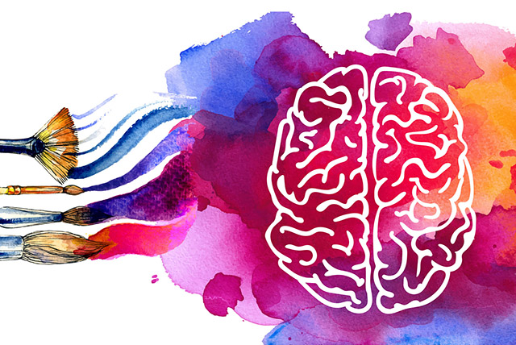

Do you know about art therapy? You may have heard of it before but you probably don’t know what it exactly is. Recently, mental health has been recognized as a serious problem. There are many ways to solve this problem, but I will explain art therapy today.

## History of art therapy
The term art therapy was first mentioned by the British artist Adrian Hill in his book "Art versus Illness." During World War II, Hill painted and felt free. He shared his experience to the patients and helped overcome their stress and trauma. Also, Hill persuaded British hospital authorities to establish art therapy as a profession. After that, an artist named Edward Adamson worked with Hill to teach painting for patients and soldiers. In this way, more and more people came into contact with art therapy and started to use the term. Even today, the number of people receiving help from art therapy is increasing. 

## hat is art therapy and who does it?
Art therapy is a treatment method that treats the body, mind, and spirit through visual art. Many people confuse art education with art therapy. Art education focuses on results, while art therapy focuses on process. The reason why the process is important in art therapy is because people express themselves and receive treatment through the process, not the result. Art therapy is used a lot these days. We have feelings and thoughts that we cannot express in words, so we can express our thoughts through art. This is why we do art therapy. Other reasons for art therapy can be when you cannot express your thoughts or feelings well, when you want to treat trauma, when you are depressed, or when you want to relax your mind. People who want to understand themselves and achieve mental growth also use art therapy.

## Advantages of art therapy
There are many advantages to art therapy. First, people who have difficulty communicating can be treated through art. Second, since many people are already familiar with art, they do not have any difficulties using art materials, so they can find art therapy to be more approachable. Third, you can do it with many people. So, you can get more effective treatment by sharing your painting with people. Fourth, art therapy promotes children's physical, mental, and cognitive development. Fifth, because artworks can be stored, you can remind yourself. This makes the treatment more effective because it allows you to look back on your past self. There are many more advantages of art therapy, but these are the main ones.

## Effects of art therapy
Many people probably wonder whether art therapy is really effective. This is because, unlike other treatments, it is impossible to know exactly what has improved with art therapy. However, there is evidence that art therapy is effective. People think of various things when they look at colors. For example, red is intense, blue is cool, yellow is lively, green is refreshing, etc. Many thoughts come to mind. However, everyone thinks differently. Some may think red is cool, blue is gloomy, yellow is cute, and green is frustrating. The reason why people think differently is because each person's experiences and thoughts are different. For this reason, people draw pictures in different styles and share them. By doing this, people can experience various experiences while their bodies and minds are being treated. 

One of the most famous art therapy tests is the PITR test. All you need is a piece of paper, a pencil, and an eraser. The test itself is also simple. All you have to do is to paint a picture according to the instructions. The instructions are like this: "It's raining. Please draw a person (not a cartoon or stick figure, but a real person) in the rain." and “Now draw as much as you want.” Everything in a painting has meaning. Rain can mean stress, and the amount of rain can mean the amount of stress. In response to rain, for example, drawing an umbrella means that you are good at relieving stress. The person in the rain means yourself. By counseling based on these components, you can find out the causes of your stress and receive treatment.