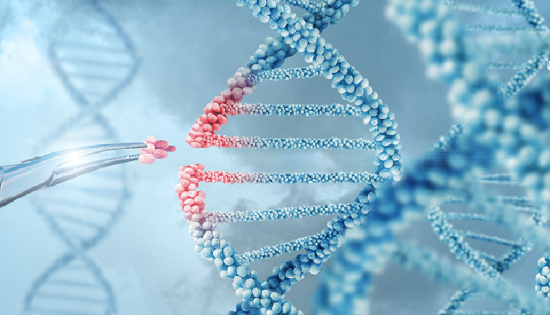

All living things have genes. Genes are the basic units of heredity that contain information necessary to form and maintain cells of living organisms. They are passed down to offsprings through reproduction. Living organisms are made up of numerous cells, and within each cell is a cell nucleus, which contains molecules called DNA (deoxyribonucleic acid). In the case of humans, there are 23 pairs of chromosomes, and each chromosome stores about 1,000 genes, which adds up to about 25,000 total genes. DNA is the code that controls most of the body's form and function. It also affects everything, such as hair color, height, etc. When there is a problem with these genes that can cause genetic problems, it is called mutation. Gene therapy was developed to prevent this. With the advantage of being able to manipulate specific DNA, gene therapy is used for biotechnology, medicine, industry, and agriculture. However, such genetic manipulation also comes with ethical problems.

One technique for gene therapy is gene editing. It is a very specific way to manipulate the sequence of DNA in an organism, so that genetic material can be added, removed, and replaced at a specific location in the genome. In this way, the composition of genes can be changed as desired. A popular gene editing tool is CRISPR-Cas9, which is an abbreviation of  “Clustered Regularly Interspaced Short Palindromic Repeats and CRISPR-Associated Protein 9.” It is faster, more accurate, and cheaper than other gene editing methods. Thus, it is the method that is studied the most due to these efficient features. The Cas9 protein is an enzyme that recognizes a specific base sequence, and precisely cuts the part you want to cut. What makes this possible is gRNA. When gRNA binds to the DNA sequence that Cas9 wants to modify, Cas9 cuts that part. Then, it inserts a new gene as a replacement. Through gene editing, enzyme properties can be changed to make it more desirable. For example, the enzyme called protease in laundry detergent helps to break down protein stains. However, its effectiveness varies depending on the temperature, but through genetic manipulation, it was made to work effectively in varying temperatures. Thanks to this, energy is saved during laundry and it is also helpful for the environment. One of the most well-known applications of gene editing is in agriculture. By introducing desired traits into the genome of plants, genetically modified crops have been developed to be resistant to pests and diseases and to survive in harsh environments. This has led to increased yields and reduced pesticide use. These advances have not only increased agricultural productivity, but have also promoted more sustainable farming practices.

Genetic editing is useful in various fields. In medicine, many diseases, including severe combined immunodeficiency, hemophilia, retinitis pigmentosa, leukemia, hereditary neurological disorders, cancer, cardiovascular diseases, and infections can be prevented or treated through genetic editing. However, like most treatments, gene editing also has its disadvantages. Sometimes, an immune system can destroy genetically modified cells. Additionally, it is difficult to insert enough genetic material into cells to fully produce the desired effect with the technology today. It also has a big impact on industry. 
Genome editing, which might seem to only benefit people, comes with ethical issues. Most changes introduced by genome editing are limited to somatic cells, not the gametes, i.e., egg and sperm cells. This means that genes that have been changed through gene editing are limited only to specific tissues and are not passed on to the next generation. However, genes of egg, sperm cells, or embryos that have been edited can be passed onto the next generation. But, whether it is acceptable to change the characteristics of embryos through these techniques raises many ethical questions. For this reason, germline and embryo genome editing is currently not permitted in many countries, including the United States.

Gene editing technology is currently used in many fields, and is being further developed, especially through CRISPR-Cas9. It has benefited many fields, including medicine, industry, and agriculture. However, it is also causing many ethical controversies.

