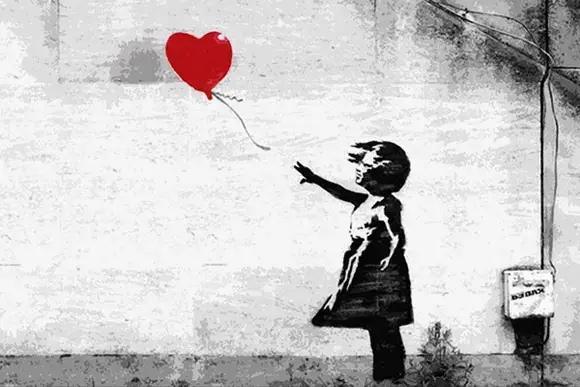

Do you know who Banksy is? If you are interested in art, you might have heard of him before, because he is a unique artist. Today, I am going to talk about Banksy.

Banksy is an artist who works secretly, so little is known about his identity. He is a graffiti artist who has been painting in Bristol, England since 1990. During the time when he started painting, the public’s view on graffiti art was mostly negative, so Banksy had to quickly paint and run away to hide his identity. To do this, he uses a technique called stenciling when he paints. The procedure for stenciling is as follows: draw a picture on a thin sheet of material, cut holes into the sheet, attach the sheet to a desired location, spray paint, and remove the sheet. He used this technique because he could just spray the painting and run away. He continues to use this method, painting only at night, so that no one can know his identity or catch sight of him painting. Banksy compared himself to a rat when he paints and runs away. If you rearrange the spelling of the word “rat,” it becomes “art.” Like this, the rat has various meanings for Banksy. He mainly makes paintings criticizing society and also does performance art.

Banksy did a lot of performance art that criticized society. When he was not famous, no one was interested in his work and did not preserve his work. But after Banksy became famous, people would even put up glasses to preserve the painting when he painted on their building. After seeing this, he asked a random person to sell his painting on the street for $60, but only three people bought the painting for 6 hours. This kind of experiment is part of his performance art. Once he sneaked into the British Museum and displayed his work, which he had painted on stone himself, but people noticed only after a few days. He secretly displayed his paintings not only once, but multiple times in places like the Louvre, the Brooklyn Museum, the Museum of Modern Art, and the Metropolitan Museum, but people took a long time to notice them. This is a criticism that people do not appreciate art works properly and do not pay attention to them. 

Among various works, there is one that has become especially famous. The picture above is a work called “Girl with Balloon.” Made in 2002, it is a stencil wall painting in London. In 2018, the work was sold for £1 million at Sotheby's auction house in the UK. As soon as it was won, however, half of the painting was shredded. After that, a video about making a frame shredder was posted on Banksy's social media. One of his messages was this: "the urge to destroy is also a creative urge." This is a quote left by Pablo Picasso. Banksy posted what he wanted to convey through this performance on his social media. People who saw it were enthusiastic, and after a while the work was auctioned again. The work was sold with a price 18 times higher than that of the first auction in 2018. He introduced this broken work with a new title, “Love is in the Bin.”

Banksy did more than just these paintings. He was also a film director, and the title of his first film is “Exit Through the Gift Shop.” The main idea of this film is that the exhibition halls are structured so that you cannot exit unless you pass through the gift shop where you can purchase items. This is a critique of the commercial nature of exhibition art. The film won the 23rd Chicago Film Critics Association Award for Best Documentary in 2010 and Indie Street Film Festival Award in 2011. If you have a chance, I recommend watching it.

Also, Banksy created a theme park called Dismaland with several artists. This name is a combination of Disney and the word “dismal”. This theme park contains criticism of modern society. The appearance of this theme park is different from the existing Disneyland, and there are many works here that can destroy people’s childhood innocence. The picture above is part of the Dismaland theme park.

Today, we talked about the faceless artist Banksy. As I explained earlier, Banksy is inspiring many people by creating and performing many works that criticize modern society. There is some controversy that he criticizes commercial art while making a lot of money doing art commercially, but no one knows if this is his true intention.

*Listen to the article as read by the author:*
<iframe width="800" height="450" src="https://www.youtube.com/embed/PSX9DBBW_5w" title="Miji Shim - December 2023 - TCA Journal" frameborder="0" allow="accelerometer; autoplay; clipboard-write; encrypted-media; gyroscope; picture-in-picture; web-share" allowfullscreen></iframe>