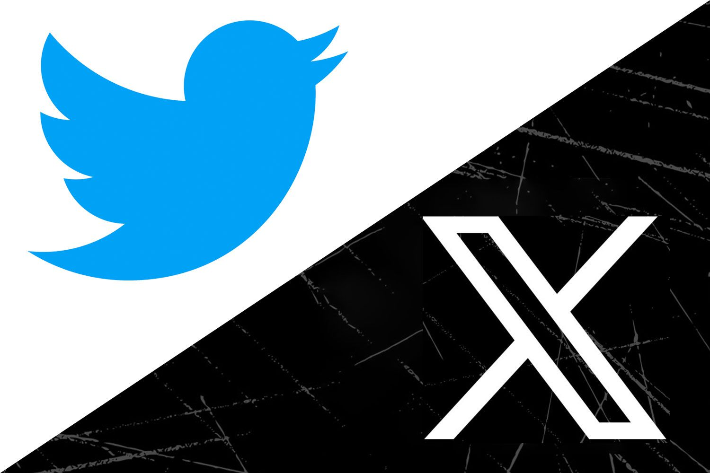

“Freaking Elon Musk took my cute little blue bird!” This was the opinion of most Twitter users after the company’s new CEO Elon Musk took the original Twitter logo and changed it to an “X”. After this big change, Twitter created various more changes that were caused by the owner, Elon Musk, and it affected its users. As a consequence of these changes, some users moved to Threads, which is a Twitter-like app found by Meta. Since Twitter is one of the most popular social media apps around the world, the recent changes might affect other social media platforms a lot. Here are some changes which were made after Musk bought Twitter.

For the first noticeable change, the blue mark, which was only allowed to celebrities, politicians, etc, became available to every user, if they paid for it. It costs $8 per month, and with the blue mark, users have a chance to edit what they uploaded and can download videos from other posts. But, after it was released, one big problem occurred. Because every user can now use the blue check mark if they just simply pay for it, some people started to fake their accounts to look like a celebrity's account, for example. To solve this problem, they made a gold check mark, which costs more than $1,000 per month to have.

Many users thought this payment system would be the only change for Musk's Twitter, but it wasn’t. Twitter made a limitation to normal users who don't pay for the blue check mark. One of them was limited views to other people’s tweets. This caused a lot of negative opinion from current users and even companies, because for companies, by having tweet viewing limitations, they are losing the chance of advertising their products to the user through Twitter. This is the most ridiculous situation ever, because no social media platform ever directly made money from its users. Instead, they made money by helping to promote companies’ products to the users by showing advertisements. 

Personally, I think social media should not earn their money from the users. Social media should always make their money from the companies who want to post banner advertisements only. This is because, when a social media platform starts making money from its users, it is just a shopping application, not a social media app. 

To summarize, I think Twitter needs to be more clear about their way of controlling this big social media platform. Still, when we search “X” on Google, we cannot immediately access Twitter because their website domain address is twitter.com. To answer the question on the title, I think the company is not ready to have the name “X”. A brand cannot change so suddenly. It should always be clear to its users.
