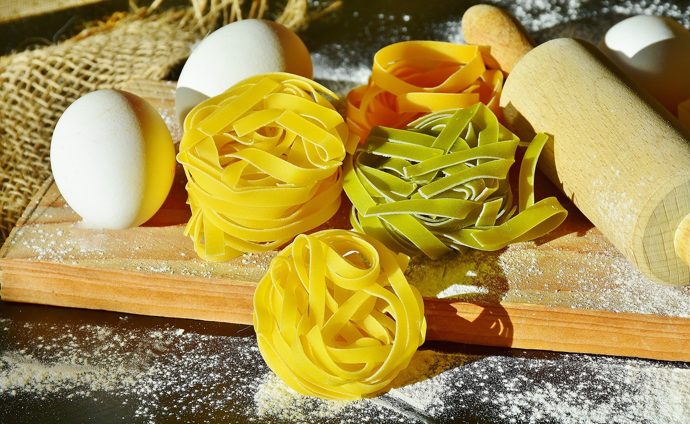

## Types of pasta

Many people like spaghetti, but a lot of them don't know that spaghetti is a type of pasta noodle.

There are many types of pasta noodles.

Pasta was first made in Italy. Today, there are about 310 types of pasta, but there are about 1300 recorded names of these pastas. Pastas are divided into two major types: dry and fresh pasta. Dry pasta include tagliatelle, maccheroni, lasagna, fettuccine, farfalle, and spaghetti. Fresh pasta includes ravioli, tortelli, lasagna, and tagliatelle.

There are various ways we eat fresh pasta and dry pasta.
Usually, people eat fresh pasta on special days, because it is tricky to make. Making fresh pasta is difficult because it is made using traditional hand techniques. Let me explain how to make fresh pasta. When we make fresh pasta, we first mix flour and eggs. Next, we add olive oil and mix it. Then, it's over. If you look at it this way, you might think it's easy. However, it's harder than you think, because you need to create the shape and put a lot of effort into it. 

Many people use dry pasta more than fresh pasta. This is because dry pasta can be stored for a long time. We can also use it faster than fresh pasta.

Normally, we divide pasta into shapes. Some shapes of pasta are long pasta, short pasta, pasta with holes, nest-shaped pasta, and pasta for soup. Examples of long pasta are linguine, spaghetti, cappellini and bigoli. Examples of short pasta types are gnocchi, rotini, maltagliati, and fusilli. Examples of nest-shaped pasta types are lasagna, fettuccine, tagliatelle,and tagliolini. Examples of pasta with holes are macaroni, cannelloni, bucatini, and rigatoni. The type of pasta for soup is lancette, filini, corallini, and sorprese.

## How to make tomato spaghetti

Now, I will explain the recipe for a common type of pasta: tomato spaghetti. To make tomato spaghetti, the ingredients are tomato sauce, spaghetti noodles, bacon, sausage, onion, garlic, mushroom, broccoli, cherry tomato and cheese powder.

Now I will explain the steps for the recipe.

First, boil the water and put 250g of spaghetti noodle, and take it out after 8 minutes.
 
Second, cut the broccoli and boil it. Then,
prepare cherry tomatoes, garlic, mushrooms, ham, bacon, and onions by cutting them into bite-sized pieces.
Third, put 1 tablespoon of olive oil in a large pan, add garlic and onion, and fry until the onion becomes transparent. Then, add bacon and fry. When the bacon shrivels, add the sauce, tomatoes, mushrooms, and broccoli.

Fourth, mix the sauce with the spaghetti noodles.
Then, the tomato spaghetti is done.

Spaghetti is both delicious and nutritious. Now, make delicious spaghetti with the pasta recipe I told you about.