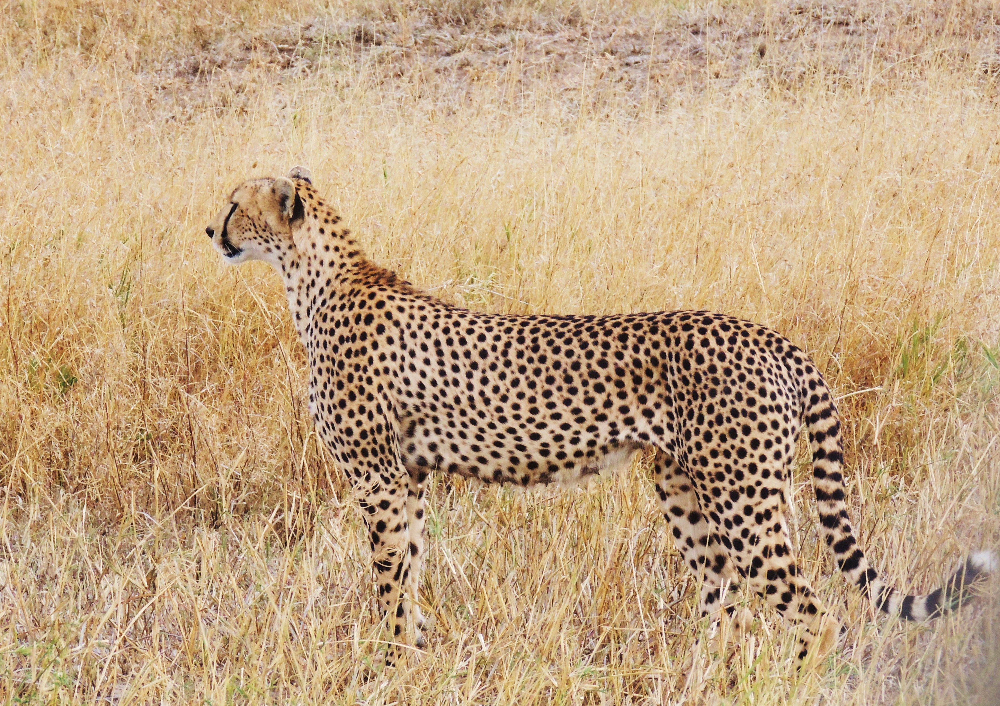

Did you know that cheetahs are the fastest land animals? These big cats hold the record for the fastest creature on solid Earth, reaching the speed of up to 120 kph. The maximum speed ever recorded was 114 kph, and they routinely reach 80-100 kph while chasing their prey. Cheetahs can’t fight larger predators, because of weak jaws and small teeth. And for their kill, young, and themselves, they only depend on their speed to protect them, and that’s why they have very slim bodies to make them light.

Cheetahs live throughout Africa including North Africa, the Sahel, and eastern and southern Africa. Over the past 50 years, cheetahs have gone extinct in at least 13 countries, but they are most common in Kenya and Tanzania in east Africa, and Namibia and Botswana in southern Africa.

About half of cheetah’s prey chases are successful. They eat small antelopes including springbok, steenbok, duikers, impala, and gazelles, but also offsprings of larger preys like warthog, kudu, hartebeest, oryx, roan and sable. They can also eat game birds and rabbits. 

Cheetahs can’t roar like other predators such as lions, leopards, tigers, and jaguars, because, while these cats have an incompletely ossified hyoid that allows them to roar, cheetahs belong to the “purring cats” subfamily with a different bone structure. There is also a debate over whether or not they can be included in the panthera group—which is a group of big, roaring cats. Cheetahs are also different from other big cats, because they only have semi-retractable claws instead of fully retractable ones.

Cheetahs have a lifespan of 10-12 years in the wild, but they can live up to 20 years maximum if kept in captivity. The average lifespan of male cheetahs in the wild is only about 8 years, due in part to the territorial conflicts with competing groups of males.

A female cheetah’s pregnancy is 90-98 days, and they can have up to 1-8 cubs in one litter, with the average being 4 cubs. Once they are born, the cubs are blind and helpless. They only weigh 8.5-15 ounces, so the mother will have to provide warmth and security. But after a day or so, the mother will leave the cubs to hunt for herself.

Cheetah cubs have long tall hair that runs from their neck all the way down to the base of their tale, called the mantle. The mantle makes cheetah cubs look like honey badgers and make them blend into tall grass, which help keep themselves safe from threats like lions or hyenas.

But sadly, cheetahs in Africa have very small chances of cubs surviving to adulthood.

After about 18 months, the cubs can finally leave their mother. Although not fully adept to hunting on their own, independent male and female cubs will stick and hunt together for a few more months to master their hunting skills, and they will finally go on to their own paths.

*Listen to the article as read by the author:*

`audio: https://www.dropbox.com/scl/fi/l177i2ecauf182fxa7pfy/sofia_0324.mp3?rlkey=ztsem4rt3uudq27wdxxfujnkc&raw=1`