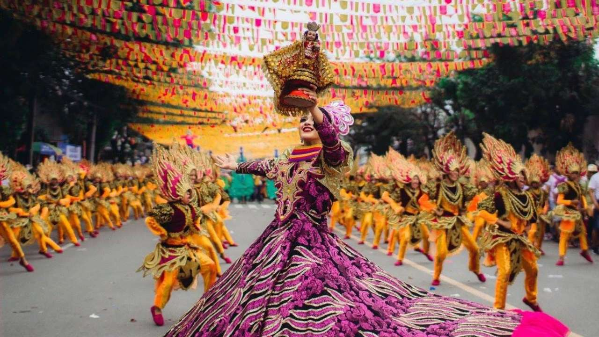

Sinulog is a famous festival that comes every January. It is a festival originating in Cebu City, Philippines that is usually held for 9 consecutive days. The first Sinulog festival is said to have been held when the adviser of King Humabon named Baladhay fell sick. From then on, Cebuanos enjoy performers parading the streets. It celebrates the Cebuanos’ conversion to Roman Catholicism and honors the Santo Niño de Cebu or Baby Jesus, because many people are Christians in the Philippines. 

The festival has a really big parade in the streets. Almost everyone comes to Cebu to celebrate the festival. It is one of the most famous festivals in the Philippines. Already attracting millions of people every year, it is becoming even more popular yearly, especially among young people. Sinulog is also something that can help spread Filipino culture and make it even more popular. The Grant Street Parade, which is the focal event, usually starts on the third Sunday of January at around 8 or 9AM.

People wear fancy clothes and visit friends and eat delicious food. No Sinulog festival is complete without its iconic food — lechon, a roasted pig that is hard on the outside and soft on the inside. It also has a very unexpected and salty taste.

Participants in the parade often wear traditional Filipino costumes, such as the baro’t saya for women and the “barong” for men. These traditional formal garments feature lightweight materials, such as silk or cotton. Other people wear clothes from crochet vests and floral crowns to denim cut-offs and tribal printed skirts. 

When I was around grade one or two, my family and I visited the Sinulog festivals, it was very crowded with hundreds of people. There were many kids running around with balloons that had paint inside it. They threw them at people walking by and everyone laughed. My mom also got hit by one balloon and she was covered in paint. We actually went there to visit her friends, and on our way, there were people singing festive songs in the streets. When we arrived at my mom’s friend’s house there was this stand outside where they had face tattoos and hair dyes. I told my mom that I wanted my hair dyed to match the parade’s theme, so we went out and dyed my hair pink, purple, and yellow in three stripes. Of course, it wasn’t permanent, but I still had it all day long. I didn’t get the face paint for some reason, but I remember that it was like an art work. We rode the motorcycle home and once we came back, we were all covered in paint.