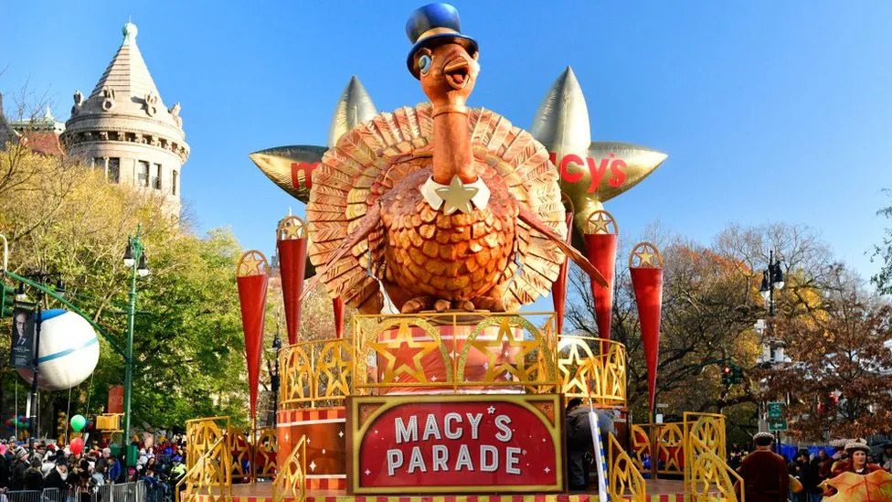

Have you ever heard of the Macy's Thanksgiving Day parade? There are many festivals and parades in New York city when it is thanksgiving, and the largest and the most iconic festival is the Macy’s Thanksgiving Day parade as it has been used to mark the start of the holidays in America. The parade first started in 1924 but has evolved a lot since the beginning. In the event’s earliest years, live animals like elephants or tigers paraded down the streets that gave the parade its character today. 

The Macy’s Thanksgiving Day parade has countless people coming from all around the world just to see the parade. The reason why this parade is so famous and has many people visiting is thanks to its — again — enormous, huge balloons, celebrity performers, marching bands, and the casts of Broadway musicals lighting the parade streets.

Its iconic balloons as well as the gorgeous floats were actually not used until 1927.  The oldest float in 1927 was Felix the Cat, which started a new era by becoming the first giant balloon in the Macy’s Thanksgiving Day parade. The original Felix balloon was actually only filled with air, and not helium. So it was held up by stilts, which is a pair of upright poles with support for the feet. Sadly the original balloon — Felix the Cat — only made two appearances, and retired following the 1933 procession. 

There was also another famous balloon called the Tom Cat. On November 25, 1932 a person named Ann Gibson and her instructor were flying in a biplane with an open cockpit and saw the Tom Cat balloon near them. So Gibson decided to aim the plane directly into the balloon, and the balloon was gone.

Besides all these balloon tragedies, the main purpose of the parade was and is to let everyone have a fun time and provide quality entertainment for them, while bringing children and families together on this most cherished national holiday. 

The Macy’s Thanksgiving Day parade is funded and run by its own company, so it is completely free for everyone.

## Thanksgiving Foods
Food is a huge part of this holiday. Many families help each other during the food preparation. The traditional foods that Americans make and prepare include turkey, gravy, cornbread, mashed potatoes, sweet potatoes, stuffing, cranberry sauce, and pie for dessert at the end of the meal.

Most Americans that celebrate Thanksgiving eat the iconic food, turkey, for their holiday meal. Together with, perhaps, other favorite foods such as green bean casserole, pumpkin pie, and mashed potatoes.

There were a few reasons why Americans started to eat turkey. One of the reasons was that there were unexpectedly many turkeys. One expert has also said that there were at least 10 million turkeys in America at the time of European contact. Another reason was that turkeys on a family farm were somehow almost always available for slaughtering.

