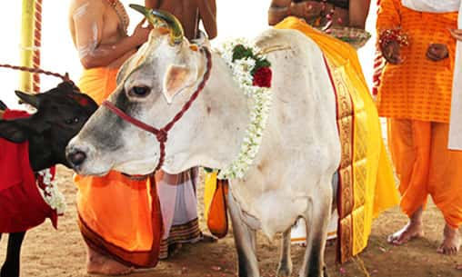

Cows are very respected in India — mostly by Hindu. If you see one crossing the streets, people — and even cars — have to stop and wait until the cow crosses the road. The reason why cows are sacred animals is because they are considered to be like mothers, and they symbolize motherly love. Mothers feed their children, which is one of the most important things when it comes to growing up and staying healthy. They are believed to be the Earthly representation of the divine and a nourishing goddess of fertility and bountifulness. 

Cow milk is believed to have a great effect on human bodies. Not just that, milk is even used to make many foods such as cheese, yogurt, butter, or cream.

In Hinduism, cows also symbolize strength and wealth. It is said that people started considering cows as sacred animals since 4th century BCE. Before they were considered sacred, cows were just like any other farm animals, sacrificed and offered to the gods — though to a limited extent in religious ceremonies — and were eaten as well. But now, Hindus avoid eating beef. If you were to eat beef as a Hindu, or slaughter the animal, the penalties could be life imprisonment in Gujarat, for example. Hindus believe that if you kill or slaughter an animal, it will bring bad karma and is seen as a violation of ahimsa — which is a Buddhist, Jainist, and Hindu tradition of respecting all living things.  So, many Hindus are vegetarians. Hinduism isn’t as strict concerning ahimsa like Buddhism and Jainism, because Hindus have eaten meat many times in history. 

There are even few shelters in India where priests take care of the cows by feeding and bathing them. The shelters are known as gaushala, and there are 7676 of them in India.

There is actually another very interesting reason why cows are very important. There is a Hindu God called Lord Krishna that millions of people believe in and worship, even from out of India. It is said and believed that cows are Krishna’s favorite animal and he and his brother Balarama look after 900, 000 cows in the spiritual world. Krishna is also known as the protector of the cows. He is said to have great affection for cows and is depicted in drawings playing his flute surrounded by many cows. 

But sadly, the male cows are abandoned by many livestock owners soon after they’re born as they don’t produce milk or calves.