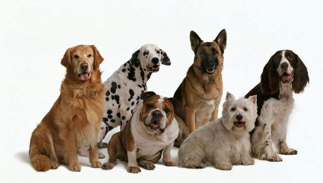

Dogs are social animals that like the company of people and other dogs. As you might already know, dogs have a lot of breeds — around 450 kinds! Often known as “man’s best friend,” dogs have an average lifespan of 10-15 years! The oldest known dog skeletons were found in the Altai Mountains of Siberia and a cave in Belgium from 33,000 years ago.

Female dogs start going into heat when they’re around six months of age. A heat is when a female dog can start having puppies. It is said that they go into heat twice a year. A normal litter (a group of puppies each time a female gives birth), size can range from 1 to 12 puppies, but 5\~6 puppies are the average. Just as every breed of dog differs by size, function, and personality, they also differ when it comes to litter size.

According to a DNA analysis in 1997, evolution from a wolf to a dog happened about 130,000 years ago. Dogs lived in packs in the wild until they started living with humans. Dogs were used for hunting and bodyguards.

Dogs are very intelligent animals. The IQ of a dog is up to 100! An average dog is as smart as a 2 year old toddler. The dog breed with the highest IQ is Border Collie. It is followed by other smart pups like the Belgian Malinois, Poodle, and German Shepherd.

Even though an average dog lives 10-15 years, there is a world record for the longest living dog. Born on May 11, 1997, Bobi, a Rafeiro do Alentejo, was crowned the world’s oldest dog on February 1, 2023.

# Poodle

I like poodles because they are cute and have great personalities. They are like a companion you always have by your side. They are also smart and easy to train!
Many dog owners in South Korea own a poodle. Because the poodle is so popular, I actually thought that it was the only dog breed in the world when I was young. The poodle breed is known to have 4 kinds: standard (45\~62cm), medium (35\~45cm), miniature (28\~35cm), and toy (24\~28cm).

Poodles are a loved breed in most countries. They were once used for hunting, but as time passed, they were kept in homes. Poodles have a very lively, active, fun-loving personality. But they can easily gain separation anxiety, which is when a dog feels scared or nervous when their owners are not with them. Of course, this is found in every dog breed, but it’s mostly found in poodles because they enjoy and love being around their owners very much. So, you have to start training your dog when they’re a puppy. 

# Maltese

Now, let’s talk about maltese. Maltese is the number one dog in South Korea in terms of popularity. They are kept by many dog owners because of their small sizes, adorable appearance, gentle behavior and playful personality. They have white fur and only have one size. The males are 21\~25cm, and the females are 20\~23cm. 