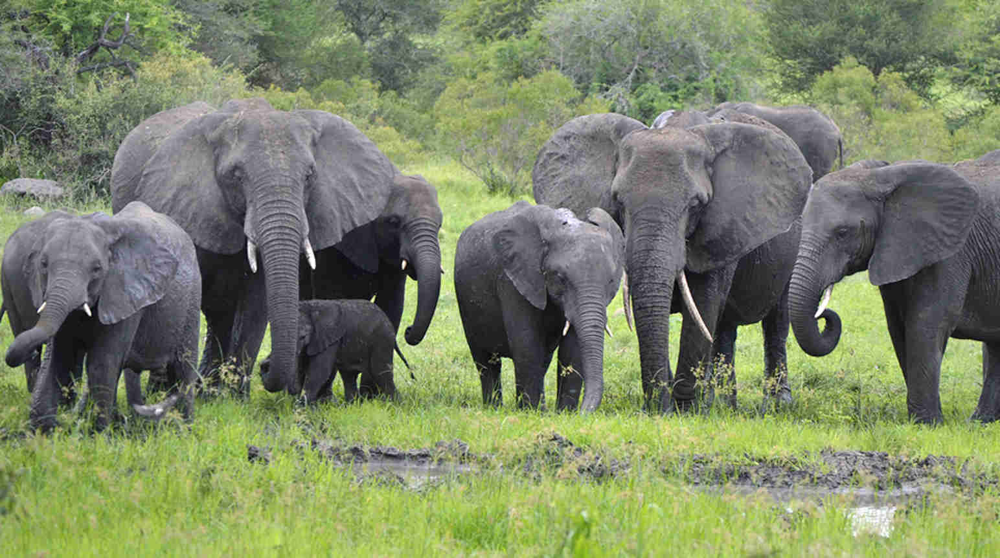

You have probably heard of elephants before. Elephants are the largest mammals living on the Earth’s surface, first found in Africa about 60 million years ago. These large mammals are herbivores — which means that they only eat plants — and live an amazing life, traveling around their habitats in herds to look out for each other. 
There are 3 types of elephants we are mostly familiar with: the African savanna elephants, African forest elephants, and Asian elephants.

Elephants mostly live in savannas, grasslands, and forests, but they occupy a wide range of habitats, including deserts, swamps, and highland in tropical and subtropical regions of Africa and Asia. Though elephants are native only to Africa and Asia, they hold significant cultural and symbolic meaning around the world such as loyalty, power, wisdom, and fertility in Hinduism and Buddhism. In India, there is even a god with an elephant face called Lord Ganesha.

Now let's talk about the appearance and functions of an elephant’s trunk. The trunk is an extended nose that is combined with the elephant’s top lip, and it is about 6 to 7 feet long.It has 40,000 muscles with no bones and can hold about 9.5 liters of water at a time! Elephants use their trunks to help drink water and use the tip — which are like fingers — to grasp onto small objects. Even though their trunks are structured like a tongue and function like an arm, it is still used as a nose. 

An elephant’s pregnancy is almost 2 years long — about 18 to 22 months! Once a calf is born, they weigh around 90-113 kg and are capable of walking within an hour after birth. Once a male elephant is between 12 and 15 years of age, they are no longer considered a calf. He leaves the herd, because bulls (male elephants) are solitary in the wild. On the other hand, females will stay in the herd forever with their aunts, mothers, sisters, and grandmothers. So, almost every herd is formed with female elephants. Full-grown male elephants are noticeably larger than full-grown female elephants. Although size depends on the type of the elephant, females, on average, are about 2.4 meters tall from shoulder to toe. Males are about half a meter taller than females. Again on average, they are 3.2 meters tall from shoulder to toe.

Elephants actually live longer than you think. Asian elephants live for about 48 years, and African elephants live for about 60 to 70 years! They have really great memories and will remember everything from their childhood till death. They will use everything they learned from childhood to help themselves survive.

Elephants are wonderful creatures of nature that are also very helpful, because they make pathways in dense forest habitats, allowing passage for other animals. An elephant’s footprints can also provide homes for tadpoles and other organisms when filled with water.

*Listen to the article as read by the author:*
<iframe width="800" height="450" src="https://www.youtube.com/embed/rJPRq9yd7yA" title="Sofia Kim - December 2023 - TCA Journal" frameborder="0" allow="accelerometer; autoplay; clipboard-write; encrypted-media; gyroscope; picture-in-picture; web-share" allowfullscreen></iframe>