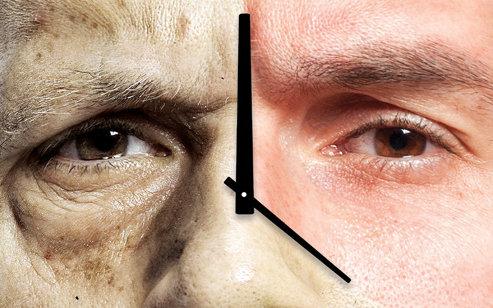

Bryan Johnson, an American entrepreneur who spends 2 million dollars a year "to be 18 again," has recently caught massive attention from the media for impressive progress made with his anti-aging regimen "Project Blueprint." People's interest about the reversibility of aging comes from the hope that it could target essentially all human diseases that occur as we grow old. Recent research on this topic has involved biology and medicine, but what does physics say about it?

One natural question people could ask is whether we can reverse the arrow of time? That is a difficult question to answer as laws in physics doesn't really make a distinction between forward and backwards in time. Additionally, time is not something we can put a slider on and fast forward or rewind. What we can look into instead is entropy.

Volcanoes erupt but don’t un-erupt, cars crash but don’t un-crash, and humans become older but not younger. All these happen due to the second law of thermodynamics, which states that the entropy (level of disorder) of any isolated system will always increase over time. However, can we reverse these processes by decreasing entropy? Maxwell's demon is a famous thought experiment that tries to answer just that.

Suppose we have an isolated box, and it is filled with hot gas on one side and cold gas on another. The gas molecules will evenly spread throughout the box as it tends to thermal equilibrium. Since temperature is the average speed of molecules, this would mean that high and low speed molecules will be mixed inside the box. Thus, the system has high entropy, and this will not change according to the second law.

However, let's say we partition the box into two sides. We also have a demon, or any entity that is aware of the speed of each molecule that is approaching the partition. Every time a fast molecule approaches from the left and a slow molecule approaches from the right, the demon opens a small door. Eventually, the left side of the partition will be filled with slow molecules (cold gas), and the right side will be filled with fast molecules (hot gas). The demon has decreased the entropy of the system.

"Woah, didn't we just violate the second law of thermodynamics?" you might ask, but we have not. If the demon is a physical being, having information regarding the speed of molecules requires order. Since the demon is outside the box, an isolated system, a decrease in entropy inside the box will be overcompensated by a larger increase in entropy outside the box. Thus, we can conclude that, in princicple, information can be used to decrease entropy and turn around any processes even including aging, but whether this is possible in practice is a different problem.

In 2019, a group of researchers from MIT made some progress. [They set up a cloud of atoms so that heat flowed from cold to hot part of a system](https://www.nature.com/articles/s41467-019-10333-7). This was achieved through quantum entanglement, which stored information that can be used to decrease entropy. Although this is quite impressive, entanglement can only be used to restore low entropy of a system with tiny molecules that exhibit quantum effects. When moved out of the quantum realm to larger scale processes like aging, irreversibility comes back.

Recently, however, [a group of Danish and German condensed matter researchers have proven that reversal of aging is possible at the macroscopic scale with glass](https://www.nature.com/articles/s41567-023-02366-z). This might initially sound random. But glass, like many materials in nature, go through molecular rearrangement as time passes. It settles to its final state slowly at a rate that we can observe, so it is what was used. The researchers measured the type of fluctuations in the material, and what they saw was a type that indicates reversibility. This came to a surprise for many physicists as we currently don't have the theoretical framework to explain such phenomenon.

Obviously, just because it was experimentally confirmed that a specific "aging process" of a specific material is reversible doesn't mean that aging in complex, biological systems is also reversible. Physicists would have to create a theoretical explanation for the process to see if reversibility can be generalized in all situations. However, this new study has created an interesting possibility that the answer to the problem of aging could lie at the intersection of condensed matter physics and biology.