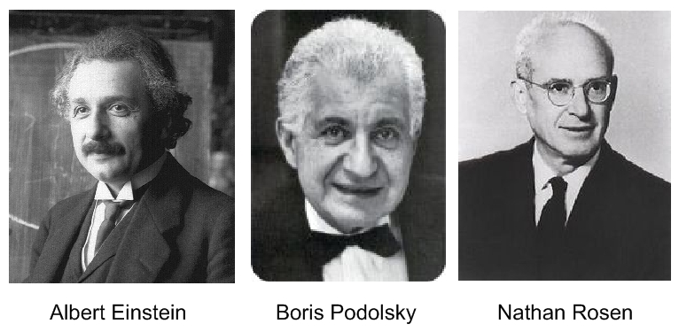
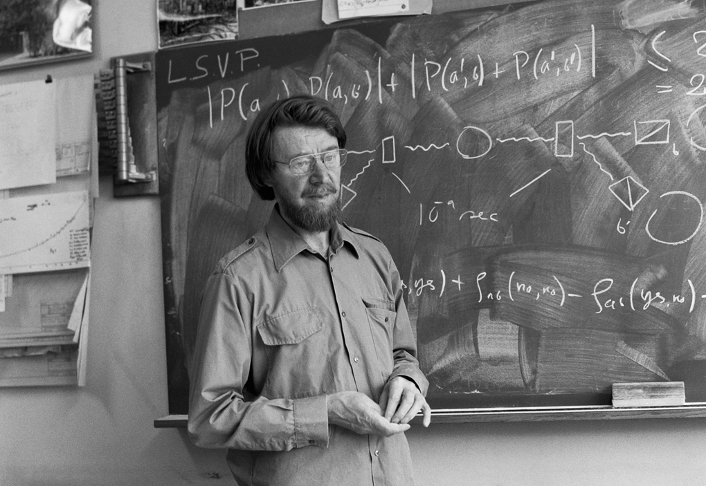

With quantum mechanics becoming a very hot topic among the scientific community due to exciting technologies like quantum computers and quantum teleportation, a lot of interest has been directed towards quantum entanglement. Unfortunately, news articles and science communicators often misrepresent the concept for a more “artistic” interpretation, referring to the famous phrase used by Albert Einstein: “spooky action at a distance.” This got worse with many articles repeating the same mistake when discussing the 2022 Nobel Prize in Physics that was awarded for experiments in quantum entanglement. To solve this issue, Chris Ferrie, a Canadian physicist at the University of Technology Sydney suggests an admittedly “bland” but effective approach to describing quantum entanglement. 

# The EPR

One of the most prominent descriptions that misrepresent quantum entanglement is the dismissal of quantum mechanics by Albert Einstein and two other scientists in the paper “Can Quantum-Mechanical Description of Physical Reality be Considered Complete”, or famously known as the EPR (the initials of the three scientists). The EPR attempted to criticize quantum theory as being incomplete. The argument stated that if quantum entanglement worked according to the rules of quantum mechanics, with two particles being invisibly linked from very far, it is essentially denying that our world is local — an object in the universe is not able to affect another object faster than the speed of light. A lot of scientists were extremely bothered by this concept back then, leading to the EPR claiming that there must exist a hidden variable that is responsible for this phenomenon; they thought that something had to exist at an imperceptible level of reality that is even beneath the subatomic world. They believed that this thing will soon be discovered and reclaim the fact that the world is locally. Unfortunately, the EPR did not spur the journey for hidden variables. This was largely because physicists did not mind about the validity of local realism as it would not affect much of their work. Thus, the “hidden variable theory” was widely supported among scientists without much doubt.

# John Stewart Bell and the Three Laureates
Most scientists did not object to the EPR for a long time because they wanted to just “shut up and calculate” according to physicist David Mermin at Cornell University. This was the case for more than 20 years before a British physicist named John Stewart Bell finally questioned the existence of hidden variables. He proposed the “Bell inequality test” which would prove or disprove the hidden variable theory through analyzing the statistical correlation of the invisible connection between two particles. Unfortunately, Bell could not perform his own test because of technical limitations.

Bell’s work was not noticed by other scientists for a decade. Fortunately, a graduate student at Columbia University John F. Clauser stumbled upon Bell’s paper in 1967. Originally, clauser was fascinated by Bell’s work that would possibly prove the existence of hidden variables, as he supported the EPR. Clauser, after confirming with Bell that the test was not yet performed, carried out the first Bell inequality test. The result changed his mind because the correlations were high enough to disprove the EPR. However, there still were loopholes that might have impacted the results due to lack of funding and reliable equipment. 

After Clauser’s attempt, a French optical physicist Alain Aspect and Austrian physicist Anton Zeilinger also attempted the Bell inequality test where they both found supporting evidence for the quantum theory. Still, there was a main loophole: any physical interaction between the two particles prior can distort the result. But recently, Zeilinger and other scientists successfully eliminated the loophole with optical technology which makes physical interaction nearly impossible. The three scientists were awarded Nobel Prizes in Physics last year.

# The Problems with the Descriptions
According to Ferrie, a typical article on quantum entanglement explains that entanglement occurs when particles interact to form a connection that remains intact regardless of the distance between them. Additionally, it is usually explained that any action taken on one of the particles instantaneously affects the other. However, quantum physics does not actually make this claim. Instead, quantum physics simply describes the experiments we perform to test our understanding of the world and provides us with probabilities for the potential outcomes of those experiments. The tendency to interpret quantum physics concepts as definitive descriptions of our physical world stems from the modern way of teaching physics.  	

To teach these concepts properly, Ferrie says, physics teachers should not start by introducing Einstein’s arguments and local realism. Rather, it is much easier to help people understand by thinking less about the classical world of physics. He gives a great example in the article [“Quantum Entanglement Isn’t All That Spooky After All”](https://www.scientificamerican.com/article/quantum-entanglement-isnt-all-that-spooky-after-all1/) published in the Scientific American. To briefly summarize the suggestion, he says to think of entanglement this way: the particles are creating a mathematical and quantum mechanical strategy before separating to maximize their chances of creating opposite states. This might only look “spooky” when assuming that they are sharing a classical strategy, but it is not at all when they simply stop using “the wrong language.”