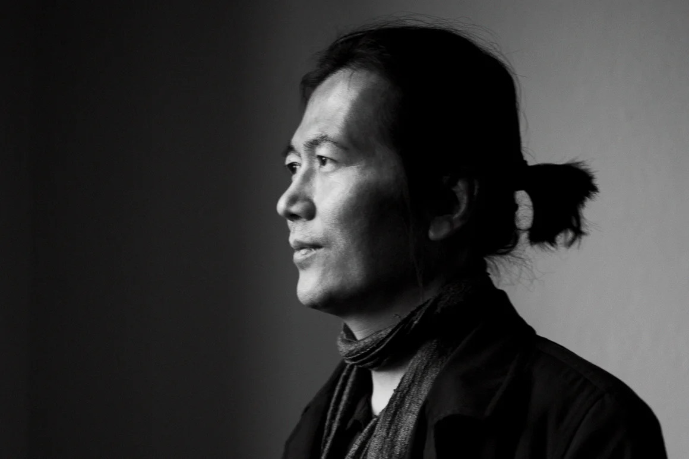

Since the Enlightenment, freedom has stood as one of the central tenets of Western society. Influential figures such as John Stuart Mill and the Founding Fathers of America all advocated for liberty as both a fundamental right and a key to human flourishing. Their efforts, at the surface, seem to have paid off: citizens in developed nations today can purchase whatever they want, pursue careers they desire, and live without enduring constant oppression from a dominant power. This is something that often fills us with immense pride, especially when reflecting on the repressive, authoritarian regimes and monarchies of the past. However, what if freedom isn't as good as it sounds? What if freedom, the very concept meant to free us from compulsion and enable us to live life to the fullest, is actually the mechanism behind the coercion in our modern society?

There are two traditionally opposing definitions of liberty: negative liberty — where there is an absense of external constraints or interference from others — and positive liberty — where there is a presence of self-determination from the individual agent.

As an example, imagine yourself lying on bed at 1 AM, having scrolled continuously for an hour. You can either turn off your phone and go to sleep or continue doomscrolling. Unfortunately, you choose the latter option and end up seeing the sun rise. With the negative definition of freedom, you are free, completely uninterrupted by external agents to choose between two options. Yet, with the positive definition, you are not free: the intricately designed social media application understood and exploited your human nature to keep you on the platform. Basically, negative liberty adopts a less restrictive standard for what counts as freedom, whereas positive liberty disregards subtle external and psychological influences for a higher form of autonomy — autonomy of rationality.

Striving for positive liberty has often been considered as a slippery slope. Throughout history, totalitarian dictators like Stalin exploited the concept of positive liberty to justify subservience to the state. Citizens were treated with cruelty and were demanded strict discipline, being falsely promised a path to a utopian society. Thus, negative liberty became the central principle of liberalism, which puts the freedom of an individual before anything else as long as one doesn't interfere with the rights of others. Many developed countries today have adopted neoliberalism, which adds even more freedom with the reduction of government intervention on the economy. However, the Korean-German philosopher Byung-Chul Han suggests that such freedom can also be dangerous.

After graduating from Korea University, Byung-Chul Han moved to Freiburg during 1980s to study philosophy and later became a professor at the Berlin University of the Arts.

Han argues that, in a society that defines an individual's freedom as the countless choices one could have made, there is a shared belief that individuals are endless projects to be reworked and transformed. This initially sounds good and all, but it is in reality a more efficient and subtle form of subjugation. Instead of an obvious, dominant power that is compelling us into action, individuals voluntarily constraint themselves to what they aspire to become. Rather than "you should do this," we are told a more insidious "you can do this." In lieu of a disciplinary society, we live in an achievement society.

This, according to Han's works, has serious consequences. The first, suggested in his book "The Burnout Society," is an over-production of stimuli. Have you ever noticed these days that there has been a rise of popularity throughout all forms of media for self-improvement and productivity? In this world of negative liberty where everyone is told to improve themselves and be productive at all times, capturing people's attention is extremely valuable. Businesses have to attract the customers, politicians the citizens, and job-seekers the employers. As a result, there is an explosion of stimuli: contents, products, goals, visions, policies, and achievements. This hinders us from deeply contemplating things, a uniquely human ability, leading to anxiety and burnout.

Another consequence of freedom in the achievement society is discussed in "Psychopolitics." Han argues that such emphasis on an individual's freedom encourages competition which, in turn, only proliferates the exchange of capital. In extreme terms, we are, according to him, nothing more than the "sexual organs of capitalism." Revolutions do not exist in such systems. Without a clear power that would, in Marxist terms, make the proletariats rise against the bourgeoisie, we are forced to blame ourselves as we are both the exploiter and the exploited. Therefore, there exists only our solitary struggle against self-exploitation and depression.

"As an ‘entrepreneur of himself’, the neoliberal achievement-subject engages in auto-exploitation willingly – and even passionately," Han says. "The self-as-a-work-of-art amounts to a beautiful but deceptive illusion that the neoliberal regime maintains in order to exhaust its resources entirely."