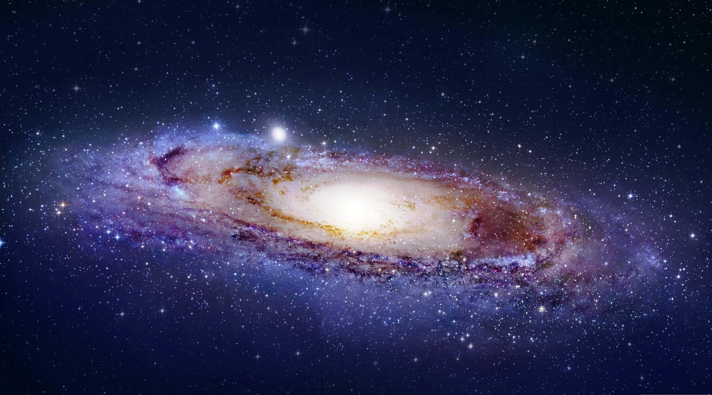

Dark matter is an integral part of the modern cosmological model of the universe when it comes to describing large galactic phenomena. Yet, it was never directly observed, so many physicists have attempted to create alternative explanations that do not require the use of this hypothetical matter. Mordehai Milgrom at the Weizmann Institute was one of these physicists, proposing modified Newtonian dynamics (MOND) in 1983 to address the observational inconsistencies that models with dark matter had. Although MOND also was not without its flaws, the hypothesis gained support from reputable physicists worldwide. However, a recent research published in the Royal Astronomical Society essentially has ruled out MOND with a high level of certainty. In this article, I will discuss what this means for dark matter and future research in cosmology. 

## Dark matter
What exactly is dark matter in the first place? Nobody knows the answer to that question. Dark matter interacts with neither light nor electromagnetic force. Thus, it is impossible with current technologies to directly observe it. Most physicists speculated that it is a subatomic particle that is yet to be discovered, while some even believe that it is composed of black holes. Then, why did physicists even hypothesize about its existence? To answer that, we need to look into the rotation of large galaxies. 

In the conventional Newton's and Einsten's theories of gravity*, gravitational force between objects drops in proportion to the square of the distance, known as the inverse square law. This means that objects farther away from the barycenter**, due to lower acceleration caused by the gravitational force, will have to move slower to stay in orbit. Indeed, this is what happens in relatively smaller orbits like our solar system. Also, in the galactic scale, velocities of stars in the inner orbit drop as predicted by the inverse square law. However, instead of continuing to drop, velocities flattens off from a certain point away from the center of a galaxy. To explain this weird phenomenon, physicists speculated that there needs to be some type of unobservable but large mass around galaxies causing the gravitational acceleration. The matter composing this mass is what we now call dark matter. 

If dark matter were to exist, scientists approximate that about 26.8 percent of the mass-energy content of the universe is composed of dark matter, whereas ordinary matter that we know of only comprises 4.9 percent.***

There have been several attempts to observe dark matter using different technologies. However, not a single attempt was successful. Many physicists were bothered by this fact. If dark matter is so abundant in the universe, why haven't we observed it? Additionally, why do we assume that the laws of gravity are correct and add unobservable matter that we do not even know the composition of? These questions gave rise to alternative explanations like MOND that tweaks the laws of gravity rather than adding new forms of matter. 

Milgrom hypothesized in his modification that the gravitational force behaves normally even in massive bodies like galaxies up to the point where the gravitational acceleration is about 100 billion times weaker than we feel on the surface of Earth. From that point, he claimed that gravity switches from inverse square law to ordinary inverse distance law. Surprisingly, MOND actually predicted galactic rotations better than dark matter. 

Nevertheless, MOND also received immense criticism. First of all, the hypothesis does not explain how the mathematical transition happens physically. Additionally, physicists have mapped dark matter, assuming it exists, using gravitational lensing — a technique used to locate large masses like dark matter by calculating how much light bends from gravity. It was confirmed that the location of large clumps of dark matter coincides with galaxy clusters, providing evidence for the existence of dark matter.

## New Evidence Against MOND
Until recently, MOND was still a popular alternative to dark matter. However, in November of this year, a group of researchers led by Indranil Banik at the University of St Andrews published [a study completely dismissing the hypothesis](https://doi.org/10.1093/mnras/stad3393). The study reanalyzed the data samples used in previous studies that had shown MOND more accurately predicts the rotation of binary star systems extremely far from each other by using a smaller sample, eliminating data with high uncertainty. Surprisingly, calculations using the new sample excluded MOND at a confidence level of 16 standard deviations. This result suggests that MOND might have came from a systematic error in data interpretation.

Although we can conclude from this study that MOND is most likely wrong, this does not provide much evidence for dark matter and [the widely accepted model of cosmology](https://en.wikipedia.org/wiki/Lambda-CDM_model). Thus, according to Banik in [his recent article](https://iai.tv/articles/the-challenge-to-dark-matter-mond-is-wrong-auid-2676), "as long as dark matter is not directly detected, we should keep an open mind to any completely new ideas about cosmology, though we must also be willing to discard such ideas if they encounter any major inconsistencies with observations."

\* : Newton's law of universal gravitation and Einstein's theory of general relativity

** : The center of mass of two objects orbiting one another

*** : Dark matter is not to be confused with dark energy, because that is what most physicists think drives the expansion of the universe. Physicists also calculate the energy content alongside mass due to the principle of [mass-energy equivalence](https://www.britannica.com/science/E-mc2-equation). 

*Listen to the article as read by the author:*
<iframe width="800" height="450" src="https://www.youtube.com/embed/xyuF9WmGhxU" title="Solomon Hyun - December 2023 - TCA Journal" frameborder="0" allow="accelerometer; autoplay; clipboard-write; encrypted-media; gyroscope; picture-in-picture; web-share" allowfullscreen></iframe>