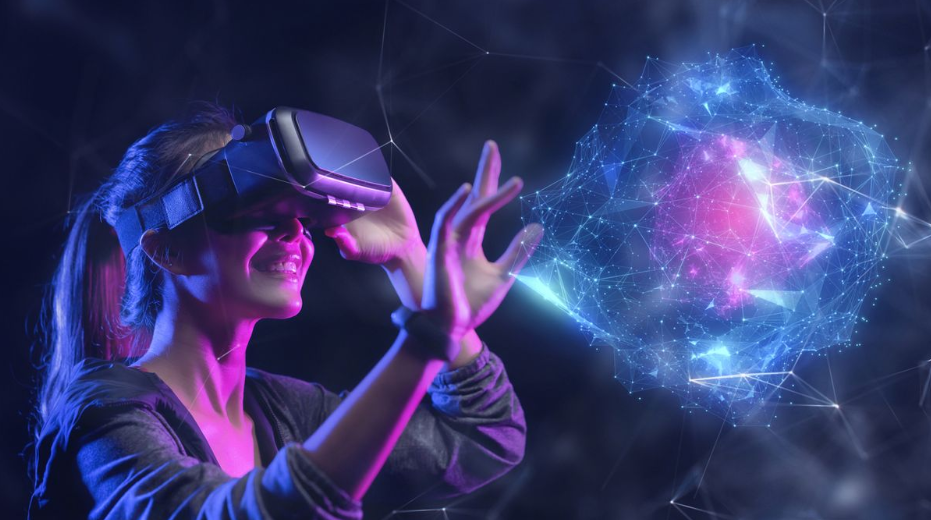

## Introduction	
Imagining floating, transparent screens has been common ever since the past. However, in modern days, people can not only imagine them, but also experience them. Virtual Reality (VR), according to the Oxford Languages, is “the computer-generated simulation of a three-dimensional image or environment that can be interacted with in a seemingly real or physical way by a person using special electronic equipment, such as a helmet with a screen inside or gloves fitted with sensors”. Virtual reality has a long history, and today, it enables diverse experiences for users through a wide variety of its types. 

## The Origin of Virtual Reality
As a concept, virtual reality has existed since the mid-20th century. The earliest known attempt at an immersive experience was Sensorama, developed by cinematographer Morton Heilig in 1962. Sensorama was an arcade-style machine that not only showed visual video but also included stereo sound, vibration, and even fragrances, allowing users to perceive as if they were actually part of the scene. At the time, this invention was considered gimmicky and therefore had limitations in its commercial viability and success. However, Sensora was the beginning of VRs. In 1966, Thomas Furness developed the term “human interface technology”, which later influenced modern-day flight simulator technologies. Several years later, in 1968,  computer scientist and interactive computing pioneer Ivan Sutherland invented the first head-mounted display (HMD), known as the Sword of Damocles. Unlike VR headsets today, it was very big and heavy. It also had to be hung on the ceiling, making it even more difficult to use. Although it had ancient computer-generated graphics, the concept of seeing a digital world through a headset was very innovative. Despite its technical limitations, it marked the start of virtual reality. 

## Developments Over Decades
The 1980s and 1990s were a time of significant technological advancements, which allowed VR to begin being adopted in mainstream applications. The term “Virtual Reality” was popularized by Jaron Lanier in 1985, who developed VPL Research, which was one of the earliest companies dedicated to developing VR technology. His team developed crucial hardware that could track hand and head movements, enabling users to interact with virtual environments, such as DataGlove and EyePhone HMD. However, mainstream applications were still limited because of their high costs, heavy and uncomfortable hardware, and limited computing abilities. In the 1990s, VRs that targeted consumers, such as Nintendo Virtual Boy, were introduced. However, due to poor graphic qualities, user discomfort, and a lack of appealing content, they failed to succeed. Still, these failures have played an important role in the successful development of VR.

## Types of Virtual Reality
There are several types of virtual reality that are used in different situations. Non-immersive virtual reality enables only minimal interaction with the virtual environment. Famous examples include driving simulators. In semi-immersive virtual reality, digital components are overlaid onto objects in the real world. As a result, digital objects can be used in similar ways to real-world objects. Well-known examples include pilot training systems. In fully immersive virtual reality, the user only recognizes the digital environment. There are no reference points to the real world during use. Currently, immersive VR technologies are widely used in the gaming industry. In this environment, equipment such as specialized data glasses, gloves, treadmills, or sensory detectors is used. All of these contribute to making digital environments feel like the real world. Theoretically, users may not be able to clearly distinguish between virtual reality and the real environment in such settings. Although augmented reality is a different form of virtual reality, the main difference between the two lies in how people experience the overlap between both worlds. A common example of augmented reality is smart glasses. 

## Conclusion
Although it may seem that there are only positive aspects of VR, the reality is different. Its high cost allows mainly wealthy people to have access, which creates a significant barrier for many users. Also, some users experience motion sickness, eye strain, or other discomfort while using VR. This is often caused by the sensory dissonance between virtual reality and the real world. Furthermore, if users become too absorbed with VR, it can lead to social isolation and reduced real-world interactions. Still, the popularity of VR remains because its advantages outweigh the disadvantages. VR’s ability to provide immersive experiences maximizes its benefits. Since the settings can be freely changed, it applies to training and simulation in many different fields. Moreover, it can be used for therapeutic purposes such as treating phobias, post-traumatic stress disorder (PTSD), and anxiety disorders, since users may not distinguish between the real world. Despite the potential risks, VR’s exclusive abilities and various types continue to provide more benefits, which explains its popularity has lasted for a long time.