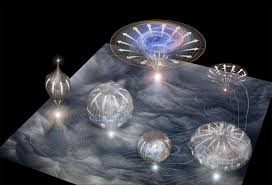

We humans live in an infinitely large universe. We cannot measure the size of the universe, let alone predict. However, there is a theory that our universe is part of an even larger collection of universes. This is called the multiverse theory. The multiverse theory consists of different predictions and theoretical statements of different physicists. 

In 1917, Einstein claimed that the universe does not expand or shrink. This is called the “static universe.” He believed that the size of the universe is constant and is finite. This theory was supported at the time. However, in 1929, astronomer Edwin Hubble found out that the distance between galaxies was getting farther. This meant that the universe is expanding. If the universe is expanding, knowing the beginning of the universe is possible by rewinding time. This is the Big Bang. Another piece of evidence that supports the Big Bang is the abundance of light elements such as hydrogen and helium. Furthermore, The WMAP satellite captured a form of the universe only 380,000 years after the Big Bang, called the cosmic microwave background. Although there is much evidence that supports the expansion, a fundamental reason for the expansion was not found. Then, physicists like Andrei Linde developed theories such as inflationary cosmology, which provided a foundation for and contributed to the development of the multiverse theory.

The multiverse theory proposes that our universe is part of a larger collection of universes, each with its own laws of physics, collections of stars and galaxies, and maybe its own intelligent civilizations. These universes are said to comprise everything that exists: the entirety of space, time, matter, energy, information, and the physical laws and constants that describe them. The different universes within the multiverse are called “parallel universes”, “flat universes”, “other universes”, “alternate universes”, “multiple universes”, “plane universes”, “parent and child universes”, “many universes”, or “many worlds”. 

There is some theoretical evidence for the multiverse theory. One of the most popular pieces of evidence is that the multiverse theory explains how the universe begins and ends. Big Bang theory is a widely supported theory. However, we get hit by several questions: how was it triggered, what existed before, and if the universe ends someday, what will happen next? The multiverse theory provides the answer to these questions. There are hypotheses that the infinite regions of the multiverse are something called braneworlds. A braneworld is a cosmological theory that suggests our universe is a 3D membrane that is embedded in a higher-dimensional space, which we can not see because we can only perceive three dimensions and an additional dimension of time. Some physicists believe that these braneworlds are bunched together like slices of bread inside a plastic bag and are mostly separated from each other, out of reach. However, occasionally, these braneworlds bump with each other, and these cataclysmic collisions are enough to cause repeated Big Bangs. Thus, the collisions enable parallel universes to restart themselves over and over. 

Max Tegmark, a physicist and a professor at MIT, proposed that there are different “levels” in the multiverse. The first level in the multiverse, according to his theory, consists of an infinite number of universes. The second level contains bubbles, which are the level 1 multiverse. This level of the multiverse can experience spontaneous symmetry breaking, which can change physical constants. The third level of the multiverse is simply another break in symmetry from the lower level multiverses, and the final, the level 4 multiverses contains everything describable by mathematical structures. Tegmark believes that the reality of the final level of the multiverse is purely mathematical. Since the level 4 multiverse is the only one with conceptually different out of the four different levels, levels 1, 2, and 3 are conceptually equivalent.

The multiverse theory proposes that our universe is a smaller part of a group of different universes that we do not know nor perceive. The start of the theory was from the Big Bang, and there is various theoretical evidence. This includes the fact that the multiverse theory can explain the start and the end of the universe. Although the multiverse theory is surrounded by controversy, its unique concepts make it a popular setting for many science fiction books and movies.