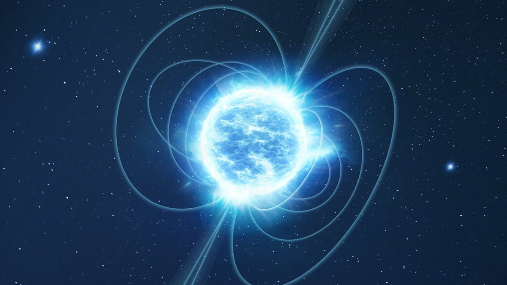

	
Neutron stars are formed when a massive star runs out of nuclear fuel in its core, ejecting monstrous amounts of energy during a supernova, leaving clouds of interstellar material rich in dust and heavy metals. When the dense stellar core at the center of the cloud is about 1 to 3 solar masses, these newly-created materials stop the collapse and leave behind a neutron star. These stars are known to be the most dense objects—almost with the sun's mass but squished down to the size of a city. A neutron star with the size of a sugar cube would weigh about 1 trillion kilograms on Earth, which is as heavy as a mountain. NASA estimates that there are about a billion neutron stars in our Milky Way Galaxy. Most of the neutron stars that have been discovered so far rotate at an incredible speed, emitting radiation over the Earth as they rotate. Older neutron stars over a billion years after their formation have a slower speed of rotation and are cooler.

No matter its size, the life of a star is a balancing act between the inward force— gravity—and the outward force provided by photons emitted. When the star runs out of hydrogen, the main sequence of conversion from hydrogen to helium ends. The energy is no longer emitted, which breaks the balance between the two forces and the star starts to collapse inward. As this happens, the nuclear fusion still goes on in the outer shell which causes the outer layers to “puff out.” These layers, as they cool down, are still left around the core, which will begin a new phase of nuclear fusion when it is massive enough, starting to convert helium into heavier elements such as carbon. 

Even stars with masses of more than 10 times the sun gradually reach their limits in converting helium to heavier elements, which usually ends with leaving behind a core with almost pure iron. However, even this heavy core is not dense enough to prevent further collapse of the massive core. As this collapse occurs, the pressure of gravity becomes so intense that the negatively charged electrons and the positively charged protons that form the iron nuclei in the stellar core are compressed with each other. This creates a sea of uncharged or neutral neutrons. Some cores of massive stars, at this point, are safe from further collapse, due to a quantum phenomenon called “neutron degeneracy pressure,” This phenomenon occurs when the density of the star is too high that neutrons can not further be packed together. This leaves a neutron star. 

When the neutron stars are formed, the conservation of angular momentum causes them to rotate at an incredibly rapid speed. Many neutron stars’ speed, as they age, reduces and can end up rotating around 8 times per second. However, neutron stars that steal stellar material from a binary partner result in different situations. These materials can be carried with their angular momentum, which means the transfer of this material can actually increase the speed of rotation of neutron stars. Some neutron stars can rotate as fast as 600 or 700 times per second, as a result. The fastest-spinning neutron star ever was discovered in 2006, according to the National Radio Astronomy Observatory (NRAO), and its name is PSR J1748–2446ad. It was found in a cluster of stars located around 28,000 light years away from the Earth. This neutron star spins around 716 times per second, or at 716 Hertz, which is faster than the blade of a blender. 

Scientists believe that as the strong magnetic field of the neutron stars forms magnetic poles, pulsar radiation beams are created. This is because when the star collapses, it is not only the mass of the star collapsing but instead, the already strong magnetic field of the star is also compressed. Magnetic fields are represented by curved lines, also known as the field lines. As the distance between the lines gets smaller, the magnetic field grows stronger. When the core of the star collapses and forms a neutron star, these field lines are also tightened, which causes the magnetic fields to be very strong too. According to the European Space Agency (ESA), some neutron stars can have magnetic fields as strong as 100 billion teslas. 