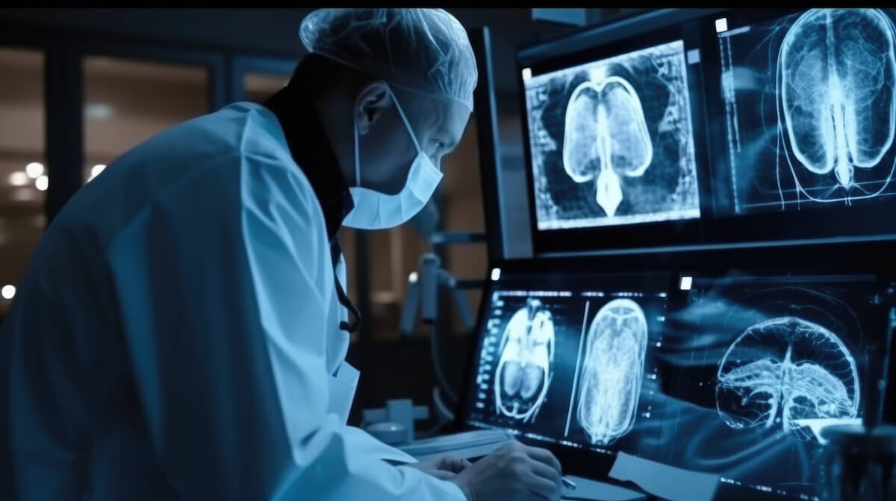

## Introduction
Artificial Intelligence, AI, has long been drawn as the nemesis of humanity in media. To illustrate, the AI defense system Skynet in the movie “The Terminator”, released in 1984, acquires self-awareness and ultimately strives to eliminate humanity for its own sake by launching nuclear missiles. As such, people have always been afraid of the development of AI that could potentially threaten both their lives and the position as the apex. Counterintuitively, however, AIs are serving as smart and accurate agents that promote humanity’s well-being. One of the most significant examples of this is AIs in the medical field, specifically in the study of cancer. 

## Artificial Intelligence for Cancer Detection
AIs are strong in detecting cancer patterns in medical images that humans can easily miss. Data like CT and MRI scans, mammograms, pathology slides, and dermoscopy images are used. Convolution Neural Networks (CNNs) or Deep learning image classifiers, are typical AI models that are employed. For example, the research team of the Stanford University utilized Inception v3 CNN, which is especially adept at image classification. Their study on skin cancer detection had AI analyze skin lesion images, and found that the accuracy of AI was indistinguishable from dermatologists. The strength of AIs, however, is clear: AIs can analyze notable amounts of images without fatigue, while consistently maintaining their pixel-level precision, allowing them to detect subtle tumor patterns. Moreover, because accurate detection of cancer is enabled, the survival rate of cancer patients can substantially increase. Early detection is especially vital for cancer, since the early- stage survival rate is 99%, whereas late-stage survival is only 30% for breast cancer; AIs are particularly strong in early detection. Still, there are concerns and risks in entrusting AIs. The biggest reason is dataset bias. Since AIs are extremely contingent on training data, their accuracy may decrease for particular age or ethnic groups that have insufficient data. Furthermore, AIs may fail to detect cancer, or conversely, may falsely detect intact tissues as cancer. Although it is highly risky to allow AI alone to make decisions, using AI as a clinical decision support tool can greatly help people. 

## Artificial Intelligence for Cancer Drug Discovery
AIs are effective tools to leverage in drug discovery as well as cancer detection. There are three main levels of pipelines in AI drug discovery: target identification, molecule generation and screening, and binding prediction. Target identification involves detecting the protein or gene that is the ultimate cause of cancer. AIs select problematic target proteins by analyzing genomic data and protein interaction networks. Molecule generation and screening involve searching chemical space and leveraging pre-existing drug data, ultimately creating candidate molecules that may serve as effective drugs. The last process involves predicting the binding affinity of the drug toward the target protein through molecular docking and energy calculation. Through optimization, also known as reinforcement learning, AI constantly adjusts molecular structure to improve binding and reduce toxicity. 

Employing AIs in drug discovery has numerous prominent benefits, but most importantly, it reduces the time. While it typically takes about 10 to 15 years to develop new drugs, using AIs can reduce this time from several months to a few years at most in the initial stage. Moreover, it is estimated to save approximately $1 to $2 billion due to reduced chances of failure. 

Still, there are also limitations and concerns. The biggest problem of AI across all fields is data quality. AIs are extremely sensitive to noisy data and incomplete datasets. Furthermore, there is a lack of clinical validation. AI-designed drugs may exhibit different effects in the actual human body when administered; although they may show more effective outcomes than expected, they may also produce unprecedented side effects that are difficult to treat. Although using AIs in drug discovery has numerous benefits, such as increased drug development speed, cost reduction, or novel molecule generation, it also poses equal risks that outweigh these benefits, including biological complexity, limited clinical validation, and data dependency. Thus, AIs are presently tools that can accelerate discovery; they cannot fully replace humans in drug development. 

## Conclusion
Despite its long history of being depicted as an adversary, artificial intelligences serve as humanity’s supporters in various fields; among them, the medical field stands as the most significant. AIs can produce highly accurate yet rapid results without fatigue, enabling doctors and researchers to analyze data more efficiently and ultimately allowing early detections that can substantially increase survival rates. Although its downsides are as significant as its benefits, leveraging AI in the medical field has been improving and will continue in this field much faster than ever before. 
