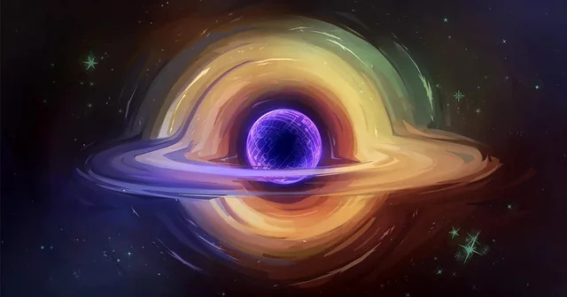

It has been nearly four hundred years ever since humans began studying the universe scientifically. Although there have been many findings throughout the short period, the universe is still covered with a lot of mysteries. One of the greatest, and probably the most important, mysteries is its fate: the end of the universe. There are many different theories about the end of the universe, including the Big Freeze, the heat theory, the Big Crunch, etc. 
	
## The Heat Death of the Universe
The heat death of the universe is one of the major theories about the end of the universe, which is a hypothetical scenario where the universe eventually reaches its maximum state of entropy; the state of maximum entropy refers to a uniformly distributed dissipated energies, leaving no regions for further changes. Entropy is defined as a measure of randomness or disorder of a system. Since there will be no more work acquired from heat transfer and all other forms of energy (mechanical, electrical, etc.), the temperature at this state would be extremely low, close to absolute zero. Since there would be no free energy in this state to do work, different processes such as the formation of stars and life would stop. Once the universe reaches the state of heat death, further changes or evolution will be impossible, remaining in the state of perpetual equilibrium. The cold death, a.k.a. the Big Freeze, is a different concept, where the universe expands forever, constantly cooling itself down until it becomes too cold to support any form of life. The opposing concept of the Big Freeze is the Big Crunch, which happens when the universe has enough matter density to contract back on itself and eventually shrink to a point, resulting in a very hot end of the universe, instead of the heat death. The concept of the heat death is based on the principles of thermodynamics, and it is a long-term scenario which is predicted to occur after billions, or even trillions years from now.

## Weakening of Dark Energy
Another theory is related to dark energy. Dark energy is a mysterious “something” that is given its name by astronomers that causes the universe to expand at an accelerated rate. If the dark energy is a cosmological constant, the heat death theory, where the universe ends cold and empty, is virtually assured. The previous theory was based on this belief, and the Lambda-CDM model was consequently made. However, after analyzing the results of a study conducted by the DESI (Dark Energy Spectroscopic Instrument), using a 3D map of the universe, which consists of about 15 million galaxies and quasars that was made over a year, they found out that the dark energy has weakened as centuries passed by. If dark energy weakens so much that it eventually disappears, the expansion of the universe might slow down or completely stop. If the force of gravity becomes stronger, the Big Crunch might happen, leading the universe to shrink. Or, in the worst case, the universe might decay into a vacuum, requiring physicists to reformulate the current laws of physics. Even if the vacuum decay does not occur, the percentage of the survival of human beings after the complete disappearance of dark energy is extremely low.

## Conclusion
After DESI analyzed the 3D map of 15 million different galaxies and quasars, astrophysicists discovered the signal of a probability of weakening dark energy. This finding has left a big question mark on the previous theories that concluded the end scenarios of the universe as the heat death based on the assumption that dark energy is a cosmological constant (Lambda-CDM). If dark energy weakens the expansion of the universe, different extreme scenarios of the end of the universe may happen such as the gravity overturning the expansion and causing the Big Crunch, or Big Rip if the negative pressure enlarges. The Hubble tension, which refers to the discrepancy between two methods of measuring the expansion rate of the universe, has weakened even more the 25-year-old argument that the universe will cool eternally. Thus, astronomers now have to cross-check the measurement of DESI with supernova data, the cosmic microwave background, large-scale structure surveys, and rewrite the equation of state for dark energy. Depending on the results, for the first time after the great discovery of dark energy, the whole cosmological paradigm might need to be reorganized. 