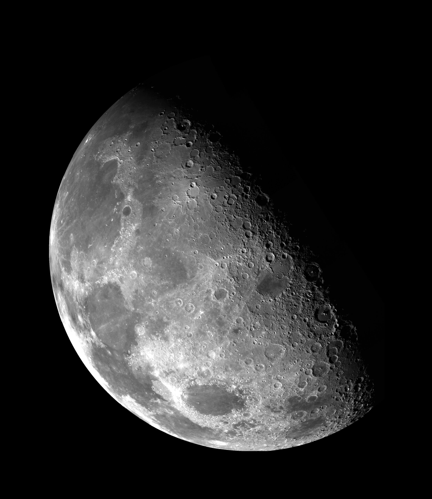

## Introduction
There are approximately 200 sextillion stars only in the observable universe. It is astonishing that despite such a huge number, mankind has never found extraterrestrials. That has led Enrico Fermi, the physicist and Nobel laureate, to come up with a question: “Where are they?” To explain this phenomenon, Robin Hanson, who majored in physics and is currently famous as a futurist, came up with a theory: There is a great wall (filter) that either makes all civilizations disappear or stops them from developing beyond a certain level. The Great Filter, presented to the world in 1996, is a concept related to the extinction of civilizations after approaching the limit of development.

## The Great Filter
Although it may sound like it due to its name, “the Great Filter”, the theory does not mean that an exogenous entity has set it. Instead, it is a way of thinking about the likelihood that certain events will happen or not happen according to the natural course. The theory states that intelligent interstellar lifeforms must first take many critical steps, with at least one of them highly improbable, based on the premise that certain hurdles are so high that virtually no species can overcome them. 

## The Hurdles 
So then what basic hurdles should creatures overcome to prosper and become a truly advanced, spacefaring civilization? Hanson has suggested a few: A planet capable of harboring life, which means including necessary components like organics and liquid water, must form in a star’s habitable zone; life itself must develop on that planet; those lifeforms must be able to reproduce, using such molecules as DNA and RNA; Simple cells (prokaryotes) must evolve into more complex cells (eukaryotes); complex, multicellular organisms must emerge; sexual reproduction, which greatly increases genetic diversity and accelerates evolution, must evolve; complex, intelligent organisms capable of using tools and manipulating their environment must evolve; those organisms must create advanced technology that is capable of space exploration and colonization (roughly a stage where humans are currently); the spacefaring species must go on to colonize other star systems, while avoiding destroying itself and successfully spreading colonization throughout the galaxy, creating a lasting interstellar presence.

Currently, humans are incapable of meaningful interstellar travel, a journey between star systems. What mankind has done so far is send small robotic probes such as the Pioneer, Voyager, and New Horizons spacecraft. However, advanced radio astronomy defines a tech-savvy civilization, a civilization that exhibits advanced technological development and relies on technology in diverse fields. Even if an alien civilization had taken a great amount of time like human civilization, there should have been several interplanetary species colonizing their entire galaxy, considering the age of the universe. But astronomers have never seen any evidence of such civilizations. 

Since the concept of the Great Filter is simply an idea about the limitation that stops civilizations’ development, no one knows whether human civilization is behind or beyond the Great Filter. However, there are many theories related to it. 

## Humanity is Beyond the Great Filter
Several plausible explanations claim that humanity is beyond the Great Filter. One of them is from an article in the NIH’s  National Library of Medicine, which claims that humanity has been beyond the hurdle of the Great Filter ever since the rise of eukaryotic cells. The eukaryotic cells arose from prokaryotes just once in four billion years; otherwise, the prokaryotes show no tendency to evolve greater complexity because their genome size is constrained by bioenergetics. The endosymbiosis that produced mitochondria has restructured DNA distribution in relation to the bioenergetic membrane. This allowed the gene expression to expand 200,000 times. This great leap in genomic capacity was solely dependent on mitochondrial power. This was the prerequisite for the complexity of the eukaryotes, which was a key innovation for the emergence of multicellular life. 

## Humanity is Behind the Great Filter
There are also different arguments that claim that humanity is still behind the Great Filter. One of them is from an article from Cornell University, which states that the rapid development of Artificial Intelligence could act as a Great Filter. More specifically, Artificial Superintelligence (ASI) that has developed rapidly from Artificial Intelligence (AI) could act as a Great Filter; a creation by humanity could lead to humanity’s extinction. These filters appear before civilizations can form a stable multiplanetary existence, suggesting that the typical longevity (L) of a technological civilization, including humanity, is less than 200 years. When this result for L is applied in the Drake equation (an equation used to calculate the number of extraterrestrial civilizations), it is consistent with the null results from the SETI (Search for extraterrestrial intelligence) survey. If an advanced civilization that we can try to communicate with disappears so quickly, discovering nothing related to extraterrestrials is understandable. 

## Conclusion
Nothing is certain about the Great Filter right now. Are we safe from it, or are we threatened by it? No one knows, and no one will ever know the truth. The Great Filter is a mystery, and it will remain a mystery. 
