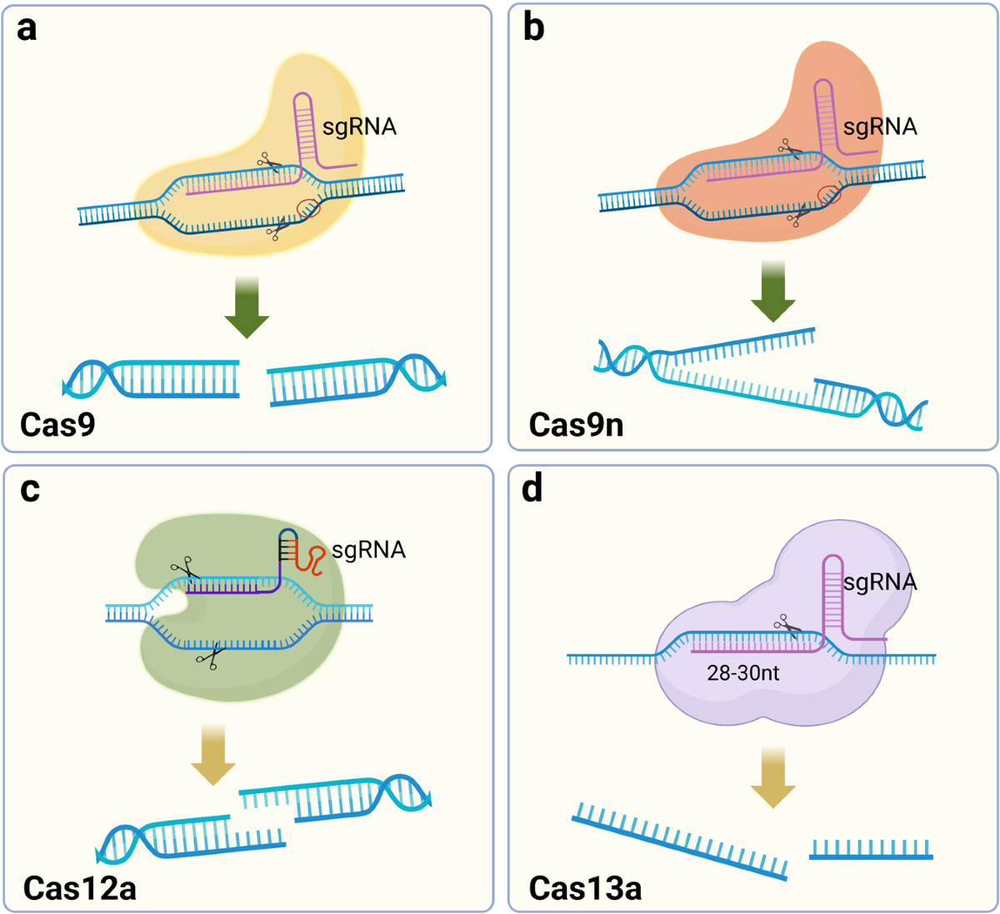

## Introduction
CRISPR-Cas9 is a major technology that has facilitated biomedical research through its numerous benefits: it enables people to correct errors in the genome and enables fast, cheap, and relatively easy gene editing compared to conventional methods; it can turn genes on and off in cells and organisms; it helps researchers rapidly generate cellular and animal models for studying diseases; it can be used to study the roles of different genes through functional genomic screening; and it has bright prospects for future medical applications, such as gene therapy, treatments for infectious diseases, etc. This article will further explore the mechanisms, functions, and potential clinical applications of CRISPR-Cas9. 

## The Mechanism of CRISPR-Cas9
CRISPR-Cas9 involves two vital components: a guide RNA to target the desired gene, and Cas9 (CRISPR-associated protein 9), which triggers a double-stranded DNA break and enables modification to the genome. Its main stages are as follows: 
1. The guide RNA (sgRNA) locates the desired DNA. This section of RNA, which binds to the target, contains approximately 18-20 nucleotides. 
2. The Cas9 protein heads to the target DNA along the sgRNA. 
3. Cas9 causes a double-strand break by cutting both strands of the double helix. For Cas9 to function properly, there must be a short, specific DNA sequence called PAM (protospacer adjacent motif) at the 3’ end of the guide RNA.
4. There are two methods to repair after the DNA cut:
    1. NHEJ (non-homologous end joining), which can quickly repair the DNA by directly connecting the broken ends without a homologous template, but thus commonly leads to small insertions/deletions of DNA.
    2. HDR (homology-directed repair), which allows precise gene editing by fixing DNA using a homologous sequence as a repair template. Theoretically, it allows changes as precise as a single base pair. 
These methods allow the disruption, replacement, or precise correction of specific DNA sequences, which enables researchers to modify genes meticulously. 

## Potential Clinical Applications of CRISPR-Cas9
There are numerous potential real-world applications of CRISPR-Cas9, but there are a few that are most prominent. Correction of genetic disorders is one of them. By enabling precise gene editing, CRISPR-Cas9 may cure genetic disorders that are caused by single-gene mutations such as cystic fibrosis (CF), Duchenne’s muscular dystrophy (DMD), or haemoglobinopathies. Several researchers have conducted experiments to cure the disorders mentioned above. For CF, CRISPR-Cas9 was used in patients to repair the most common mutation in adult intestinal stem cells, which restored CFTR function. For DMD, it was used to eliminate the mutated exon and restore dystrophin expression, which partially recovered muscle functional deficiencies in treated mice. In the case of haemoglobinopathies, researchers showed that fetal haemoglobin could be induced through BCL11A enhancer disruption by CRISPR-Cas9, which could be applied to patients with diseases such as sickle cell disease or thalassaemias. 

CRISPR-Cas9 has the potential to be implemented in patients with infectious diseases such as HIV. Researchers showed that CRISPR-Cas9 can target HIV-1 genome activity and inactivate gene expression and replication of HIV. Also, a few cells could be immunized against HIV-1 infection. This approach could be used as gene therapy or genetically in altered stem cells to treat infected individuals and eliminate HIV. 

There is also increasing interest in CRISPR-Cas9’s potential to modify ex vivo (taken out of the body) patient-derived T cells or stem/progenitor cells and reimplant them. T-cell genome engineering has succeeded in treating haematological malignancies and has the potential to be applied to solid cancers, primary immune deficiencies, and autoimmune diseases. For instance, CRISPR-Cas9 can modify the human T-cell genome and prevent the expression of PD-1 protein, which could help T-cells target solid cancers. CRISPR-Cas9 can also be used in pluripotent stem cells; to illustrate, human induced pluripotent stem cells can correct mutations that occur in β-thalassaemia.

## Limitations of CRISPR-Cas9
One of the biggest problems with CRISPR-Cas9 is accurately delivering CRISPR-Cas9 to the target cell. This problem is amplified if gene editing is done in vivo – inside the patient’s body. A suitable vector is required to deliver Cas9-nuclease-encoding genes and guide RNAs without toxicity. AAV has been preferred for gene delivery, but its small size reduces the efficiency in transduction of the Cas9 gene, which could affect efficacy. Moreover, CRISPR-Cas9 may edit undesired parts of the genome, other than the targeted section. These unintentional edits may affect the patient in the long term and may cause malignancy. To decrease the risk of off-target activity, the Cas9 nuclease enzyme concentration and the time required for Cas9 expression are important. Also, there remains a major ethical controversy: gene editing in human embryos. It has been demonstrated that CRISPR-Cas9 can alter a human embryo’s genome and can theoretically be used for preimplantation treatment of genetic diseases. However, the long-term consequences remain unclear. As the ethical boundaries within which CRISPR-Cas9 can be used are not fully determined, the clinical use of CRISPR-Cas9 is still limited.
