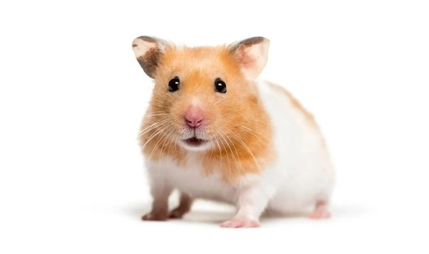

Hamsters are warm-blooded mammals that live 2~4 years. They are one of the smallest mammals on Earth. There are over 20 species of hamsters, but only five of them are common as pets. The other species are the wild hamsters mostly found in Europe and Asia. But the common pet hamsters can be found all around the world. 

The first wild hamsters were discovered in Europe and Asia in the countries of Romania, Greece, Syria, Belgium, and northern China. It is said that the original group of Syrian hamsters were found in the region around Mount Aleppo in Syria. After being found in the 1800s, many people thought that these species went extinct until a mother with her pups was found in 1930.

The domestication of the Syrian hamster began in the late 1700s when wildlife experts tamed and bred them. In 1930, researchers captured Syrian hamster breeding stock for animal testing. Further domestication, which means to tame an animal, led hamsters to become a popular pet all around the world. The Syrian hamsters are the most popular type of pet hamsters, because they are the largest species of hamsters and easier to handle.

Hamsters can have around 6-12 pups on average, although some litters contain even 20 pups. Pups are born blind, deaf, and hairless. After 12 weeks, all species of hamsters mature. However, Syrian hamsters mature only after 5 weeks because they are very territorial, which means that they are very protective of their territory. When a pup becomes 21-28 days old, they are ready to leave their mother and live on their own. In the wild, female hamsters go into heat only in spring and summer. In typical domestic settings, they will breed year-round.

Hamsters are omnivores which means that they can eat both meat and vegetables. Hamsters that live in the wild eat grass, seeds, and even insects. Wild hamsters also hibernate during the winter but wake up periodically to feed themselves. 
Sometimes if you don’t keep your pet hamsters in a warm place, they are likely to also hibernate, but hibernation is something that most domestic hamsters never experience.

## Dwarf Hamsters

Dwarf hamsters are one of the smallest species of hamsters. There are several kinds of dwarf hamsters, but the most common ones are the Campbell’s, Winter Whites, Chinese, and Roborovski. The Roborovski dwarf hamster is the smallest out of all the dwarf hamsters. They live about 3~4 years, are about 2 inches long, and weigh around an ounce. At birth, they are less than an inch long. These species are the hamsters that can live in pairs or a group. It is said that they are friendlier towards humans if they have a cagemate.

Even though dwarf hamsters look friendly, they are rather aggressive compared to Syrian hamsters. If they have not been socializing properly from a young age, they may become defensive when they feel threatened.

