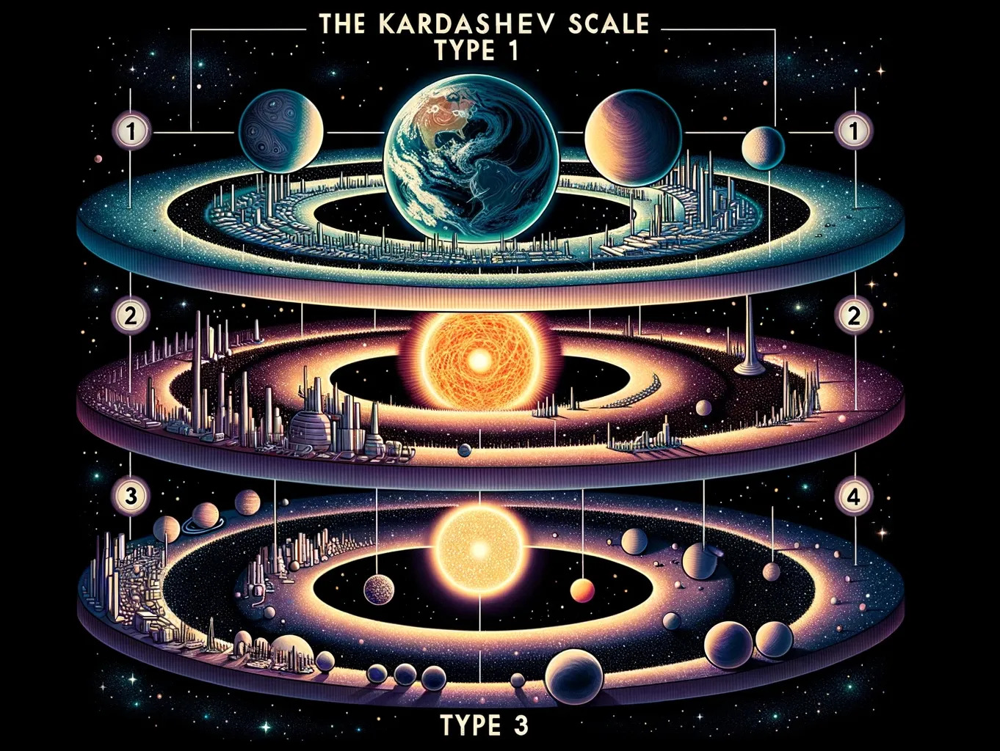

Imagine a future where people have access to the energy of an entire star, or even an entire galaxy. Imagining this pushes the boundaries of our imagination even deeper: How much can humans develop, and what are the drawbacks for it? The Kardashev scale, a scale that classifies different types of civilization based on their energy consumption, provides us a path to depict our future journey toward a more developed civilization. 

## What is the Kardashev Scale?
The Kardashev scale, proposed in 1964 by Nikoli Kardashev during consideration of important question related to the Study for Extraterrestrial Intelligence (SETI), classifies a civilization based on its development. The Kardashev scale still remains as one of the most influential concepts from SETI. 

## Who was Kardashev?
Nikolai Kardashev, the original proposer of the Kardashev scale, was a Soviet astrophysicist who studied under Josef Shklovskii, the author of the book “Intelligent Life in the Universe.” Kardashev developed a technique called the very-long-baseline interferometry, which uses a global network of radio dishes as one radio telescope. It is most commonly used by the Event Horizon Telescope to observe blackholes. Kardashev was on his own for much of his early childhood. His parents were the victims of the Great Purge in 1937 and 1938, forcing him to be sent to an orphanage. After graduating from Moscow State University, where he studied radio astronomy, he worked at the Sternberg Astronomical Institute in Moscow. At the Institute, he earned his Ph.D. in 1962. 

## Pre-Type 1
Pre-type 1 civilization is one where humanity consumes less energy than what is emitted from the star. The consumption of energy is inefficient, with less than 100 percent of the available energy used. As an example, the emission of CO2 from burning fossil fuel illustrates that our current civilization on Earth is pre-Type 1, since the emitted gas is not being used efficiently but is instead released into the atmosphere. 

## Type I
The Kardashev scale describes Type 1 as “technological close to the level presently attained on the Earth”. The civilizations that appear in the movie “Star Trek” or “Star Wars” are considered to be between Type 1 and 2. Entering Type 1 will allow humanity to control weather, natural disasters, climate change, etc, and thus eliminate all the side effects of the development of technology. The amount of energy would be as abundant as oxygen, and there will not be any international conflicts due to energy deficiency. Also, there are speculations saying that entering Type 1 would allow humanity to terraform mars. However, for humanity to enter Type 1, the amount of energy spent should be at least 500~600 times more than what is being spent currently, which is predicted to take about 100 years. For this to be possible, humans should increase the efficiency of solar panels or commercialize fusion power. 

## Type II 
The Kardashev scale describes Type 2 as “a civilization capable of harnessing the energy radiated by its own star”. If Type 1 is using the energy from smaller stars like the Sun, type 2 is using the energy from very large stars. The Galactic Empire from the movie “Star Wars” falls under Type 2. To become a Type 2 civilization, the energy consumption should be 10 billion times Type 1, thus requiring humanity to terraform and completely conquer other planets in the solar system. Additionally, the Dyson sphere, a hypothetical megastructure that encompasses the star and absorbs its energy, is mandatory for humanity to enter Type 2. However, scientists have a skeptical view of humanity’s possibility to enter Type 2 because it is impossible to build a single Dyson sphere even using all of the resources in the solar system. This means that a Dyson ring or Dyson swarm should be built as a replacement, which means that the energy of the star is not used entirely. Thus, it is hard to predict whether it will take thousands or even million years for humanity to reach Type 2. If humanity ever succeeds to enter Type 2, it is predicted that the energy from different stars, such as Proxima Centauri or Alpha Centauri, will be used. Structures will be built on a planetary scale, and hyperspace jump or warp will be available. 

## Type III
The Kardashev scale describes Type 3 as “a civilization in possession of energy on the scale of its own galaxy.” Type 2 civilization will look for more and more energy, eventually using the stars of a whole galaxy. This is Type 3 civilization. Type 3 civilization consumes about 10 billion times the energy consumption of Type 2. By the time Type 3 is reached, a civilization would have conquered most of the stars in the galaxy they belong to. Like the civilization that appeared in the movie “Interstellar”, humans will be able to make space-time rifts, entrances to other universes, and use the blackhole at the center of the galaxy as a source of energy. Type 3 civilization is basically monopolizing the energy of the entire universe. Also, unlike Type 2 civilization, which builds the structure at the size of a planet, Type 3 builds a universe-sized structure. Furthermore, this civilization will be able to communicate with and control locations several light-years far. Comparing Type 3 with the current, pre-Type 1 civilization is like comparing ants to humans. However, the Milky Way galaxy will never achieve Type 3 civilization because, to use the energy of the entire galaxy, the influence of humanity should extend beyond the Milky Way. 

## Conclusion
The Kardashev scale shows the limitless potential of human development. Although all these ideas seem unrealistic, there is a possibility of them becoming true in the future. The Kardashev scales can act as a guide for future development, a clear pathway allowing humans to imagine and look forward to the future, where all the dreams of today come true. 