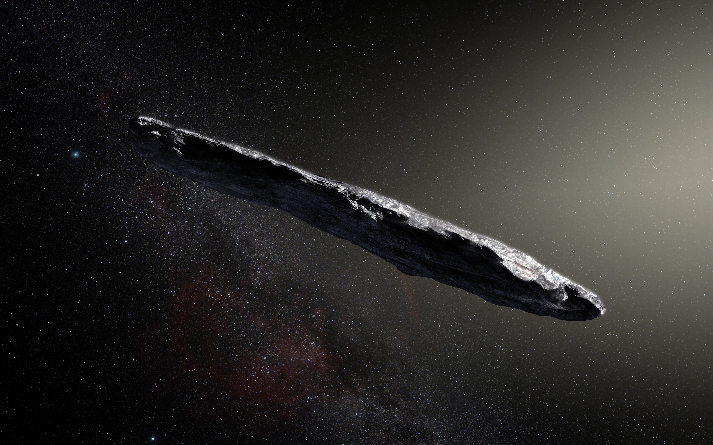

There are a lot of mysteries surrounding extraterrestrial creatures, or the aliens. The concept of aliens became a widely debated topic at the start of the 20th century, despite its origins existing since ancient times. However, when an interstellar object named Oumuamua was discovered in Hawaii in 2017, it gave a great shock to academic communities. The discovery of Oumuamua raised speculations about the possible existence of aliens, whether in the distant past or the present. 

Oumuamua was first discovered using a telescope named Pan-STARRS 1. Oumuamua means “a messenger from afar arriving first” in Hawaiian. It was not a big deal at the time, but it started to become a huge topic of discussion after it was moving way too fast to be considered an ordinary celestial body. Its speed, 196,000 mph or 87.3 kilometers per second, along with its trajectory whipping around the Sun, made astronomers confident that Oumuamua originated beyond our solar system. This speed is so fast that it could not be explained by the Sun’s gravity alone. Thus, it must have entered the Solar System at an already high speed, without any interaction with other planets. Not only its speed but also its size could not be explained. Oumuamua is up to one-quarter mile (400 meters) long and highly elongated. Its length is perhaps 10 times as long as its width. This ratio is greater than any asteroids or comets discovered during the modern times. Observations suggest that this extraordinary object has been wandering the Milky Way for hundreds of million years before it reached our solar system. Right after this discovery, telescopes around the world were used to measure the orbit, brightness, and color of Oumuamua. The result from different telescopes found that Oumuamua varies in brightness by a factor of 10 as it spins on its axis every 73 hours. None of the asteroids or comets from the Solar System have varied this wide in brightness. Oumuamua was also found to have a  reddish color and to be completely inert, without any hint of dust around it. These findings led to the conclusion that Oumuamua is dense with no water or ice, and has a reddened surface due to the effects of irradiation from cosmic rays over time.

However, NASA has discovered that Oumuamua got an unexpected boost in speed and a shift in trajectory as it passed through the inner Solar System in the same year it was discovered. It turned out that there was some other force affecting its motion than the gravitational forces of the Sun and the planets. One member of NASA speculated that the additional subtle force on Oumuamua likely is caused by jets of gaseous material expelled from its surface. Comets normally eject large amounts of dust and gas when warmed by the Sun. However, a team of scientists including Olivier Hainaut claimed that there were no visible signs of outgassing from Oumuamua, making the prediction impossible. Thus, it was concluded that Oumuamua’s outgassing may have produced a very small amount of dust particles – enough to give the object a little kick in speed, but not enough to be detected. 

To explain this substantial acceleration it gained, Avi Loeb, chair of astronomy at Harvard, has proposed that “Oumuamua is an alien solar sail, harnessing the radiation pressure from the Sun to navigate the cosmos.”  If Oumuamua is a solar sail, this might explain both its anomalous acceleration and shape. Solar sails like Oumuamua may be a low-cost and efficient way of traveling through interstellar space, and this technology has been used in recent technology demonstrations from the Planetary Society. One potential problem for solar sails to work is that it must be very light and thin. The Planetary Society’s LightSail 2 spacecraft is a square-shaped object almost six meters each side, but it weighs less than a bowling ball. Imagining such a delicate object might not survive the harsh interstellar travel is easy. Thus, in a recent paper, Shumel Bialy and Avi Loeb conducted a series of quick calculations to argue that interstellar travel might not be so tough.

Oumuamua was a new human revelation at the time. It was the first step of the humans becoming a bit convinced of the existence of aliens. Human attempts to discover whether aliens exist have been ongoing, and will continue in the future. 