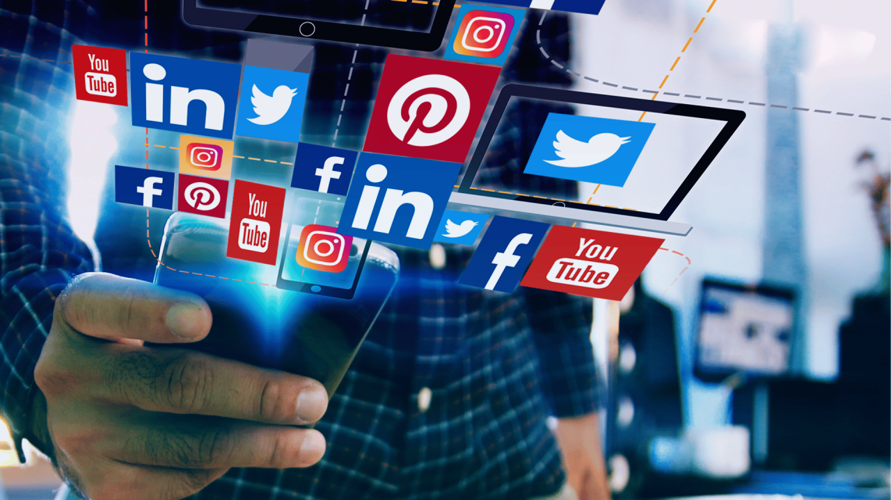

These days, most trends originate from a shared source: social media. Social media is one of the most ubiquitous forms of the internet, used by most, if not all, people today. It offers diverse opportunities that no other form of the internet can replace, which is why its user base and preference are much higher compared to other online platforms. As its popularity increases over time, so does its influence on users. Social media’s growing influence means that, although it has the potential to spread positive effects, it can also have negative effects.

One of the biggest drawbacks of frequent social media use is addiction. To diagnose social media addiction, certain conditions should be met: neglecting real-life work and previously enjoyed activities, inability to stop using social media, obsession with social media when not online, intense distress or anger when unable to use it, using social media secretly, and disruption of regular sleeping, eating, and exercise patterns. These changes in behavior could indicate unhealthy social media use, as well as addiction. Although social media addiction has many negative effects, the most dangerous is sleep deprivation. 

Sleep is one of the most important factors in our lifespan. However, excessive use and addiction to social media can disrupt it. Studies show that the average American checks their phone 334 times a day. Many teenagers sleep with their phones and even wake up during the night to check notifications, preventing uninterrupted sleep. Sleep deprivation can result from various causes, such as staying awake instead of sleeping or having poor quality of sleep, which usually leads to feeling tired. Sleep has a huge impact on our lives. Therefore, sleep deprivation can increase the risk of suicide, depression, anxiety, aggression, psychological distress, difficulty concentrating, hyperactivity, nervousness, substance abuse, and long-term mental illness. While minor sleep deprivation is usually not a major problem, research shows that chronic sleep deprivation can lead to diverse health issues. 

Moreover, intense social media use can lead to a shorter attention span. Most social media platforms have short-form features, such as Instagram reels, YouTube shorts, or TikTok posts. When a video seems boring, continuous scrolling provides users with a new dopamine fix. Endless algorithmic content keeps users completely immersed, causing them to scroll aimlessly. The brain adapts to these short, intense spikes of dopamine, making it only able to process small and brief forms of media at once, which ultimately makes it harder for people to stay focused and on task. According to a study conducted by the Pew Research Center among students, 31% of the teenagers reported losing focus in class due to constant cell phone use, and 49% said using technology for purposes unrelated to class, or “off-task” use, distracted them. The impact of social media is significant; research by Microsoft found that many people now have an attention span shorter than a goldfish—less than 9 seconds.

Although it may seem like social media only has downsides, it can also have positive effects. Social media can improve users’ mental health, provide a hub of ideas, and offer diverse opportunities such as professional networking or starting a business. And most importantly, it allows people to connect with new people, develop communication skills, and maintain social bonds, no matter the distance. Since social media curates content based on algorithms’ data according to the users’ preferences, it can be easy for people to find others with similar ideas and interests. It also makes it much easier to start building new connections and developing relationships. Finding or forming a close-knit community helps people feel valued and accepted, which can lead to higher self-esteem and self-confidence. Furthermore, by allowing distant contact, social media helps people easily maintain existing relationships. Sending messages, calling, sharing photos, or hosting video chats can all contribute to staying in touch. It offers a chance to easily communicate and share content, whether people live near each other or on opposite sides of the world. 

Social media can provide diverse experiences and opportunities that cannot be replaced by anything else. However, excessive use has a significantly negative impact on people. As with everything else, the optimal amount of use can maximize its positive effects while minimizing the negative impacts.

