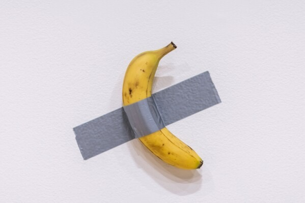

Can you believe that this banana affixed to a white wall with a piece of silver tape has a price of  6.2 million dollars?

This artwork is called “Comedian”, by Maurizio Cattelan, an Italian artist. Cattelan first displayed “Comedian” at Art Basel Miami, an annual international art fair in 2019. He explained that the artwork  is a sincere commentary and reflection on what they hold.

At the same time,  David Datuna, a performance artist, ate the banana and became very popular. After the banana was eaten,  even more people came to watch the exhibition of “Comedian”. In 2023, a South Korean art university student also ate the banana from the artwork that was exhibited, which grabbed public attention once again. Both artists ate the banana as a form of artistic expression. 

Many people wondered who had purchased “Comedian”, and soon discovered that it was bought by Justin Sun, a Chinese cryptocurrency entrepreneur. He purchased  the artwork for 6.2 million dollars. According to him, “the artwork Comedian represents a cultural phenomenon that bridges the worlds of art, memes, and the cryptocurrency community.” He further stated that he would eat the banana as part of a unique artistic experience honoring its place in both art history and popular culture.

