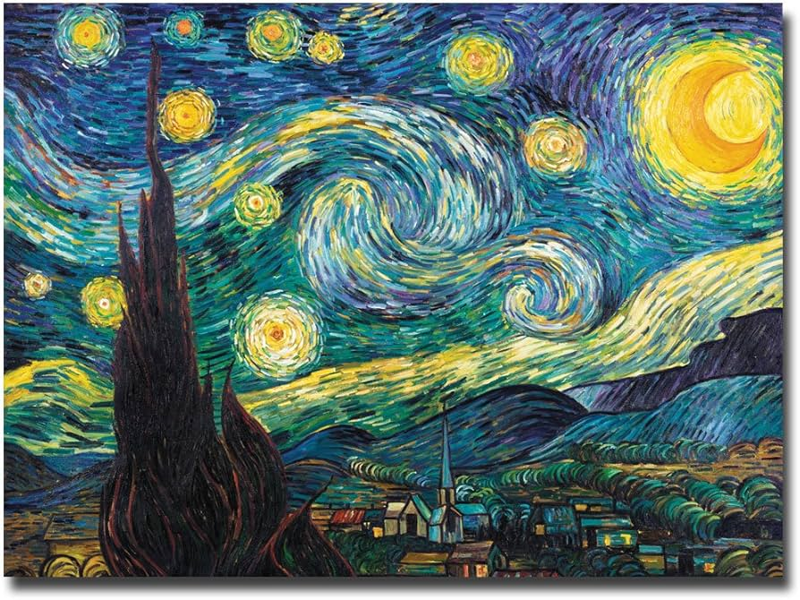

Vincent Van Gogh was one of the most famous painters in the 19th century. He painted many famous paintings. Among  his famous art works, The Starry Night is the one  everyone knows. He painted this piece when he was mentally ill, capturing the view outside the window of his asylum within three days. 

There are many analyses  and interpretations of this work, but not many people know why there are 11 stars depicted in it. Van Gogh, who was a devotee and raised by a pastor’s father, often included christian symbolism in his paintings. 
If we look at the painting, we can see a total of eleven twinkling stars scattered across a sky in different sizes. Scientists compared the year the painting was created with the actual number of stars visible at the time and confirmed that there are more stars in the painting than there were in reality. 

As many have mentioned, Van Gogh was a Christian. Therefore, if we look at the biblical anecdote and the situation Van Gogh was in at the time, the number eleven can be seen as a struggle of Joseph’s eleven brothers who have suffered. On the other hand, the moon can be interpreted as a reward that Jacob received for enduring difficulties and living a proper life. 
