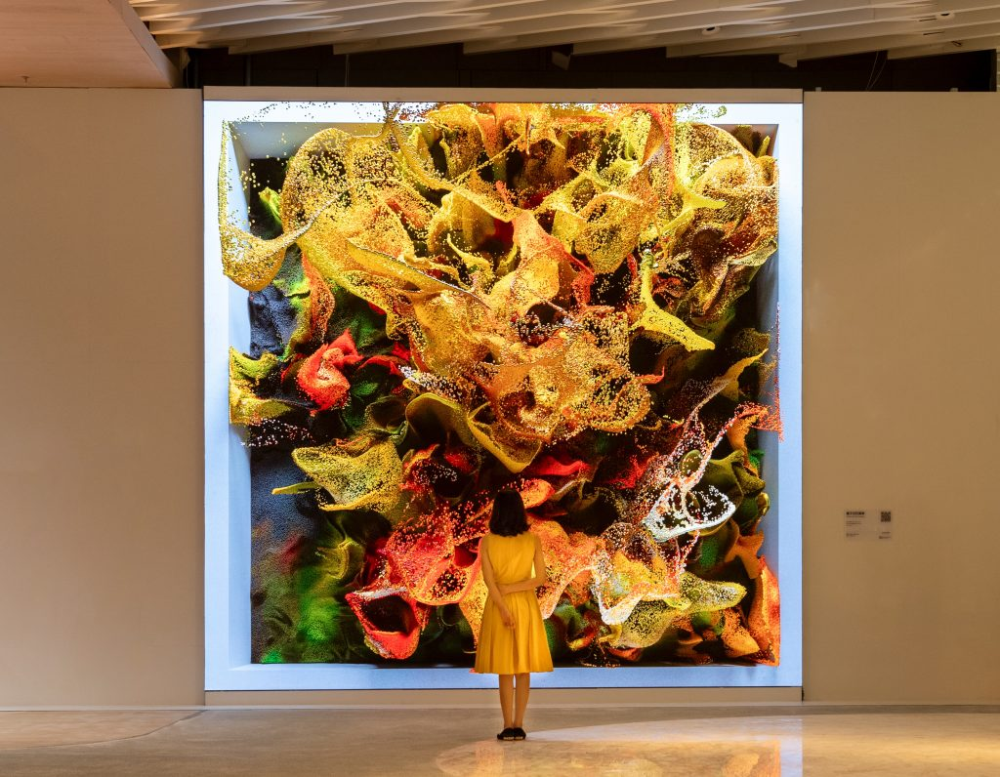

An art exhibition made completely with artificial intelligence was held in San Francisco. It was the first time that all the artwork in a show was created only by AI.

Exios, a U.S. news outlet, reported that this special art exhibition used the image-generating AI called DALL E.  The show ran from October 26th to December. 29th at the Bitforms Gallery in San Francisco. 

The event was called “Artificial Imagination", and it was organized by Bitforms Gallery SF and Day One Ventures. The organizers said it was the first art exhibition inspired by DALL E.  

There are still many concerns and controversies about art works made by AI. Although copyright problems are not fully solved,this exhibition showed how much AI is starting to influence the art world. 
