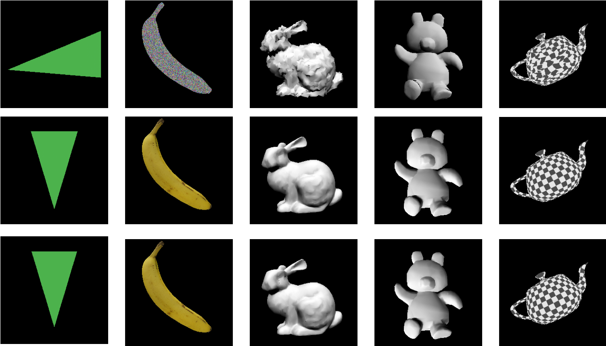

Artificial intelligence (AI) can bring a significant change for humans, and like most technologies it has both positive and negative impact on our society. What effect it would have on our society is still uncertain. Thus, there are many challenges to be faced in the future.

To begin with, AI will undoubtedly increase our work efficiency more than ever before. However, even though AI does benefit humans, it will start replacing human jobs. According to a study done by the Bank of Korea, AI may replace more than 4 million jobs in South Korea. As a result, for some people, it could be challenging to maintain a living. Thus, this will have a significant impact on our society economically and politically. Now, a new question arises: will AI become as smart as humans and try to control us? This is still a debated topic, but we all know there are always consequences that come along when we rely too much on something. These unexpected things might challenge us too. 

Moreover, we have to make sure that AIs do not obtain their own personalities and thoughts. This means that we always have to be aware of them. The original purpose of AI is to benefit and advance humanity, but if it tries to achieve its own goals no matter what the consequence is, it might have a harmful impact on mankind. As a result, it is vital to be vigilant in making sure that the algorithms are well-designed to purely benefit humanity. On the other hand, there are undoubtedly benefits of AI too. AI has been playing a great role in creating a society with processing and analyzing huge amounts of data, leading to greater efficiencies in many fields. For instance, AI technologies are able to create videos and even make 2D images into 3D. With the help of AI, we might be able to revolutionize film production. 

Furthermore, AI can greatly increase the efficiency of work. Machines today are capable of doing repetitive work, but they still cannot complete many complex tasks that humans perform. However, advanced AIs in the near future would be able to take over jobs such as bookkeepers, police officers, doctors, and other customer service roles. 

Nowadays, many companies are competing to make autonomous cars with AI. Although there are autonomous cars already, they are not perfect enough to be used on complex roads. Thus, if someone succeeds in making this, it will be revolutionary. When someone is driving a car, they have to be fully concentrated in driving in order to prevent accidents. However, if there are autonomous cars, they could use the time in a variety of ways. For example, if someone has urgent work to do, they could do it while the car is driving itself. As a result, if autonomous cars succeed, it would greatly benefit humanity by providing them much more time. 

Additionally, in the field of law, humans are not always perfect. Someone might have committed a serious crime, but the judge might not sentence the person enough time in jail. This means that one might commit a serious crime and walk away easily if the judge is unable to make a fair judgment. However, if an AI is the judge, it would be able to rationally judge whether it is a serious crime or not. In contrast, in some areas, human judges might be better. An example could be when the criminal is able to change the evidence and trick the AI. If it is a person, they would have easily seen through, but AIs are perfectly based on the evidence. Thus, they would not be able to make a fair judgment unless the AI is extremely advanced.

In conclusion, people in the near future would have to directly face the impact of AI on humanity. On the positive side, AI is able to provide people with time, efficiency, and productivity. On the negative side, however, they might stand against humans showing hostility. Thus, it is vital to make sure that we are able to perfectly control AIs. 

*Listen to the article as read by the author:*

`audio: https://www.dropbox.com/scl/fi/yc8hiuefgyglu5t095n9t/theodore_0124.mp3?rlkey=uphbls7vxcuadq1iz6o4tqi9t&raw=1`