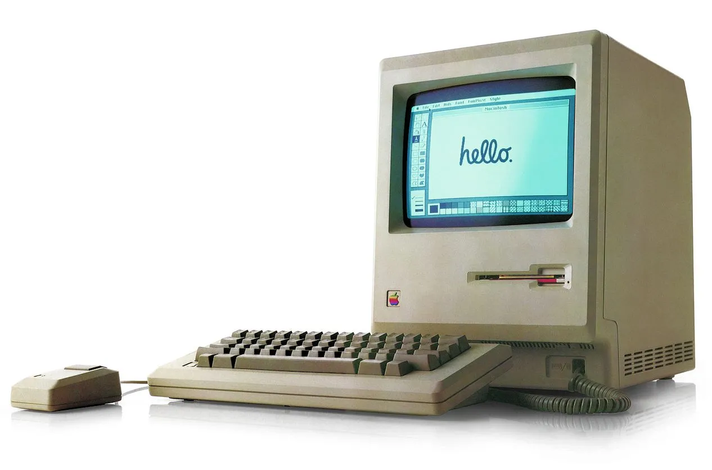

Nowadays, computers have become a necessary part of daily life; however, just a few decades ago, they were the size of a small room and could only perform simple arithmetic. Contrastingly, present-day computers work at an incomparable speed while being able to perform complex tasks such as predicting future events and analyzing human personality. A major distinction between past computers and ones developed presently is that nowadays, computers can perform multiple functions at the same time, while earlier models could only perform a single, simple  task. This article aims to explore the major events in the evolution of computers and compare early machines to current ones. 

The mechanical era, before 1940, officially opened the age of automated computing tools. Among them, the most famous ones were tools such as the abacus, Pascaline, and Babbage’s analytical engine. These machines, contrary to commonly imagined computers, do not have monitors or other interactive devices like keyboards and mice. On the other hand, these tools looked like antique machines and worked on a conceptual level or were operated manually by people. One of the renowned inventors during this time was Charles Babbage, who was also called the “Father of the computer”. The Analytical Engine was designed by him and was the world’s first general-purpose computer. General-purpose computers are like smartphones and laptops, while special-purpose computers are limited to performing one given task. His general-purpose computer was mechanical and even had a memory and a CPU. It was able to perform basic math and had a form of programming. The programming function consisted of punched cards and was physically read. While Charles Babbage is the creator of computers, Ada Lovelace, his collaborator, is known as the first computer programmer. She was the one who wrote the algorithm for the programming language adapted for the Analytical Engine. 

After the mechanical era, during the 1940s and 50s, vacuum tube computers were constructed. These computers ran on glass tubes that managed electricity like how current transistors work. They were extremely huge, slow, and consumed an immense amount of power, meaning that overheating was common. Like the Analytical Engine, these could only do basic calculations and needed a punched card to input user data. The best example of these types of computers was the ENIAC, widely known as the first electronic general-purpose computer developed in 1945. Later, UNIVAC I was constructed, which was the first commercial computer widely utilized in governments and businesses. These computers were used mainly by governments and the military. For instance, ENIAC was used as a machine to solve out complex passwords used during World War II. 

Soon, transistors were developed, and once they came out, they replaced vacuum tubes. The transistors were much smaller, faster, and more durable compared to glass tubes. The computers that used these were referred to as second-generation computers, and third-generation computers involved integrated circuits (ICs). After these came out, the price of computers became affordable for the public. As they became more accessible, more programming languages, such as COBOL and FORTRAN, were developed. COBOL, also known as Common Business Oriented Language, looked like English sentences and was easy to read. This system is still used in old banks nowadays. FORTRAN, short for Formula Translation, was one of the first high-level programming languages and was mainly used for  scientific and engineering calculations. 

In the 1970s and 90s, a boom of personal computers began. This is the period when Apple and IBM started to spread their names. Apple was founded by Steve Jobs and Steve Wozniak and created one of the first, most popular personal computers, the Apple II. IBM was a rival company of Apple, and it also launched a personal computer called the IBM PC. This is also the period when GUI, Graphical User Interface, was introduced. GUI is a visual system where the user can interact with the device through elements like menus and icons. This was a revolution that created Windows, keyboards, and mice. With Windows came the internet, which allowed people to connect worldwide. As this technology developed, it led to the creation of smartphones and new technologies like AI, machine learning, and cloud computing.  These advanced machines allowed advances not only in the area of computer science but numerous fields such as medicine, manufacturing, education, entertainment, and virtually all existing fields. 

To conclude, while computers seem powerful and sophisticated, their beginning was nothing but a simple mechanical machine. Initially born with gears, it progressed into a combination of electrical circuits and complex engineering. It revolutionized human life by providing convenience and the ability to foresee events. It hasn’t been a century since the first general-purpose computer came out, and it has developed at a meteoritic rate. Soon, mankind will experience yet another revolution when many unfinished technologies, like quantum computers and neuromorphic computers, are fully constructed. 