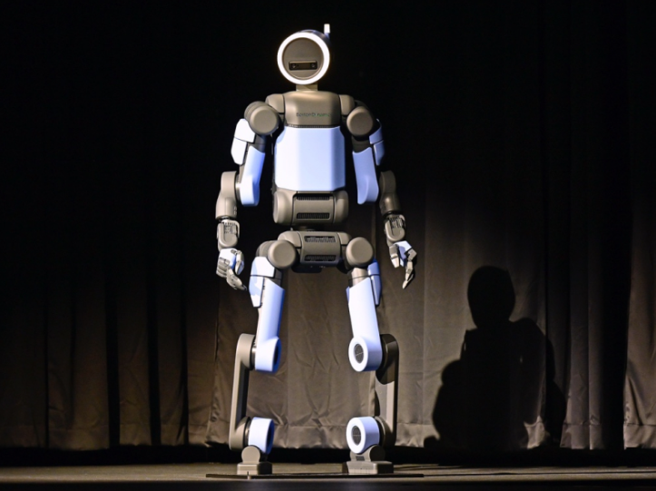

Humans learn to walk and run from a very young age. We do it without consciously thinking about the detailed coordination of every muscle or joint in the legs. Walking does not require us to calculate the angle at which our feet contact the ground. However, robots need to calculate everything. They need to maintain balance and coordinate many joints, understand terrain elevation and roughness, and use energy as efficiently as possible — this complex process must be done every time a humanoid lifts its foot. In essence, the three fundamental challenges that make walking difficult for robots are the instability of two legs, the number of joints, and the unpredictability of the environment. 

To begin with, two legs are extremely unstable. When humans stand on two feet, the area underneath and between our feet forms a “support polygon”. Leaning too far will lead you to fall because your body can not generate the forces needed to recover. Walking makes this more difficult. While walking, there are times when the whole body must be supported by one leg while the other is swinging. During this phase, the entire mass of the robot is focused on one foot, dramatically reducing the area required for support. Bipedal walking, compared to wheeled or four-legged robots, is much more difficult to stabilize. A humanoid on two feet must consider the center of mass — the imaginary point where the robot’s mass is concentrated — moving relative to the feet. A simple analogy to explain this is an inverted pendulum. A normal pendulum hangs downward and naturally returns to equilibrium after swinging. On the other hand, think of vertically balancing a pencil on your hand. You would have to constantly move your hand to prevent it from falling, finding the balance. A robot that walks on two feet is doing this movement every time it takes a step. 

Not only is it difficult to balance the robot, but every joint must work together in sync. Humans walk with hip, knee, ankle, torso, arms, and pelvis movement all together. Each and every one of these parts adds degrees of freedom (DOF) — an independent direction in which a part of the robot can move. As the number of joints increases, the harder the robot becomes to control. One of the most famous modern humanoids, Atlas, has 56 degrees of freedom. The movements of each joint are not as simple as we normally think of. Each actuator — a motor that converts energy into mechanical motion — must be carefully controlled because movement changes the center of mass and force, momentum, and balance. The whole body must be carefully coordinated, and the motors can’t simply be moved without considering diverse variables. 

Even though a robot can move perfectly on flat ground, this doesn’t mean it can move successfully on rough surfaces too. What would happen if the ground is just 2 cm higher than the robot has calculated? For preprogrammed humanoids, even a difference this minute could cause the foot to land much earlier than expected, disrupting the entire walking motion. To tackle this, humanoids need a system called “feedback control”. After the robot senses the environment, it has to calculate the motion, adjust it, and the cycle repeats. Sensors such as IMUs – an inertial measurement unit — measure conditions such as acceleration and rotation. The joint encoders measure the specific position or rotation of the joints; the force or torque sensors help determine forces between the robot and the environment; the cameras, depth sensors, and LiDARs help detect objects such as stairs, obstacles, and terrain so that the robot can adapt to different surroundings. The difficult part of walking is not the walking animation, but the process of calculating all these in a matter of seconds so that the robot doesn’t tumble down. 

Even with precise sensors and perfectly coordinated joints, walking is still extremely difficult outside a controlled lab environment. Although there are sensors to check for uneven ground, stairs, and slippery surfaces, unexpected obstacles can still disrupt the robot's balance. To overcome these drawbacks, modern humanoid robots use a combination of feedback control and advanced learning methods. Engineers can train the robot through simulations and reinforcement learning. This enables robots to recover from disturbances without physical damage. However, strong and well-made hardware is still mandatory since software cannot overcome bad design. The motors, joints, traction, weight distribution, and balance must be well designed for the robot to go into software training in the first place. 

Although walking is extremely simple for humans, the mechanisms under it are complex. Only through perfect coordination, mechanical design, and software can a robot achieve bipedal walking. Every step a robot takes shows the effort and careful thinking the engineers put into it. For robots, walking is not simply a movement; it is a series of constant calculations and adjustments. 
